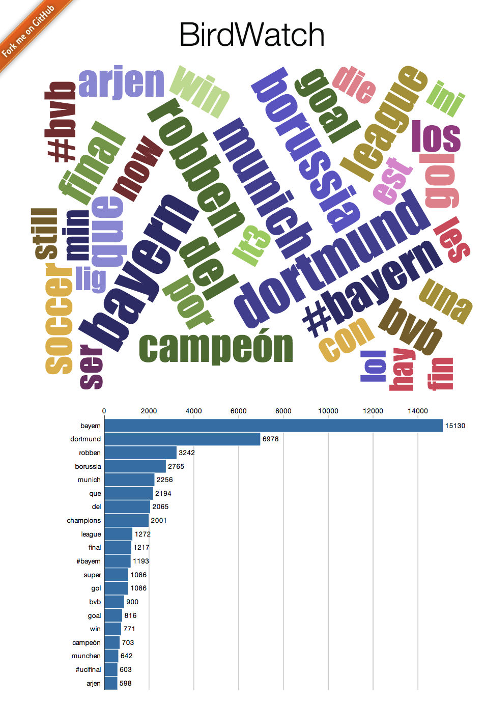
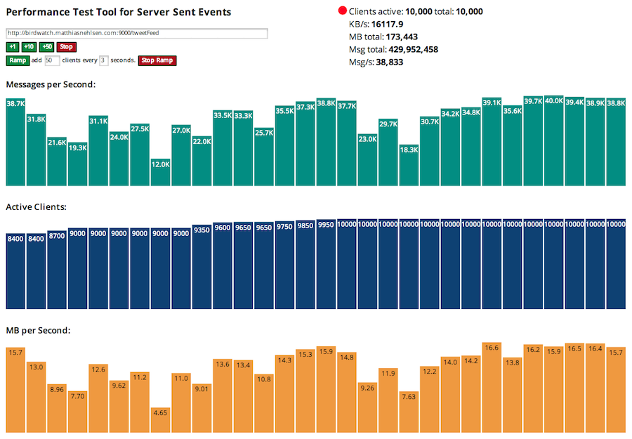

Some weeks ago when I started working on the **[BirdWatch](http://bit.ly/BirdWatch)** project, I basically wanted to play around with Iteratees and stream information to the browser, any information. But in the meantime, I have become more excited in making Tweet visualizations useful and interesting. First I needed to move the reasoning over to the client though because the server side reasoning did not scale well at all. In the latest update I address both client-side reasoning and the first steps in making the application interactive.

My other application on GitHub, **[sse-perf](http://bit.ly/sse-perf)**, was quite useful in identifying where the scalability problem was. When getting as many as 1% of all Tweets from Twitter, which is the current limit for the **[Twitter Streaming API](https://dev.twitter.com/docs/streaming-apis)** without some extra agreement with Twitter (amounting to 3-4 million Tweets a day), server-side calculations for each client connection only allowed somewhere between ten and twenty concurrent connections whereas moving the calculations over to the client side now allows about 600 concurrent connections to a single server under the same load.

With that problem out of the way, I also added interactive functionality where the words in the word cloud and in the bar chart are now clickable, allowing drilling into the data. Currently this works with a logical AND. Only previous and live Tweets are now shown that contain all of the search words. The queries are resources that can be bookmarked, with the query encoded in the URL, comparable to a Google search.

Ok, this is becoming a little more interesting than the previous version where the observer did not have any influence over what was shown on the screen. I have used the current version of **[BirdWatch](http://bit.ly/BirdWatch)** for following Tweets about the Champions League final between Bayern München and Borussia Dortmund at Wembley stadium (besides the TV, of course): 



It was interesting to see a correlation between events in the game and the teams being mentioned in the Tweets. But that experience also showed me what is missing and could be addressed in a future version: a time component. I would find it interesting to track words and hashtags over time. That will be much more interesting and shall come in a future version.

Let's look at a few implementation details in the current version:

####Filter Enumeratee
Tweets from the TwitterClient are delivered to connected clients using a channel and enumerator provided by Concurrent.broadcast in the Play Iteratee API.


````scala
  /** system-wide channel / enumerator for attaching SSE streams to clients*/
  val (tweetsOut, tweetChannel) = Concurrent.broadcast[Tweet]
````

The Tweets are from there fed into the EventSource object which acts as a simple Iteratee that does nothing more than generate a chunked HTTP response, with "data: " prepended to every piece of data (Tweets as **[JSON](http://tools.ietf.org/html/rfc4627)** in this case), like this:

````js
data: {"tweet_id":339406567420080130,"img_url":"http://a0.twimg.com/profile_images/3669634376/302cdf34520f1ffd45395438da689c3f_normal.jpeg","profile_url":"http://twitter.com/muhammadmucin","screen_name":"muhammadmucin","text":"RT @Milanello: Video: Nesta vs. Juventus (Champions League final in 2003): http://t.co/heGrklYXo6 #TempestaPerfettaNesta","followers":361,"words":13,"chars":120,"timestamp":1369755806000,"hashtags":[{"text":"TempestaPerfettaNesta","indices":[98,120]}],"user_mentions":[{"screen_name":"Milanello","indices":[3,13]}],"urls":[{"url":"http://t.co/heGrklYXo6","expanded_url":"http://sulia.com/milanello/f/43a24f3c-54e5-48ba-9653-508476c3fbc0/","display_url":"sulia.com/milanello/f/43…"}],"timeAgo":"367 ms ago"}
````

I already used a transforming Enumeratee before, for transforming Tweets in case class form into **[JSON](http://tools.ietf.org/html/rfc4627)**. It is very simple to put another Enumeratee into this chain for filtering only those Tweets that contain the desired search words:


````scala
  /** Enumeratee: Tweet to JsValue adapter */
  val tweetToJson: Enumeratee[Tweet, JsValue] = Enumeratee.map[Tweet] { 
    t => Json.toJson(t) 
  }
  
  /** Tests if all comma-separated words in q are contained in Tweet.text  */
  def containsAll(t: Tweet, q: String): Boolean = {
    val tokens = q.toLowerCase.split(",")
    val matches = tokens.foldLeft(0) {
      case (acc, token) if t.text.toLowerCase.contains(token) =>  acc + 1
      case (acc, token) => acc
    }
    matches == tokens.length 
  }

  /** Filtering Enumeratee applying containsAll function*/
  def textFilter(q: String) = Enumeratee.filter[Tweet] { 
    t: Tweet => containsAll(t, q) 
  }

  /** Serves Tweets as Server Sent Events over HTTP connection */
  def tweetFeed(q: String) = Action {
    implicit req => {
      RequestLogger.log(req, "/tweetFeed", 200)
      Ok.stream(TwitterClient.tweetsOut 
        &> textFilter(q) 
        &> tweetToJson 
        &> EventSource()).as("text/event-stream")
    }
  }
````

The filtering Enumeratee above is nothing more than a convenient way to run a predicate function on every data item and pass data down the chain only when the predicate function evaluates to true.

####Queries as bookmarkable resources
Queries against the system are now represented by a particular URL that encodes the query string. This URL represents the resource of that particular query within a stream of Tweets at the time of the request. Examples: **[Dortmund AND Bayern](http://bit.ly/bw_dortmund_bayern)** or **[Wembley AND soccer](http://bit.ly/wembley_soccer)**.

####No more image processing
Initially I was playing around with image processing on the server side. But once that was working with a supervised actor hierarchy, it really wasn't all that interesting any more. I know that I can easily process 4 million of the large Twitter profile images a day without putting substantial load on my quadcore server. That's what I wanted to know. Other than that, the images were littering my harddrive space, without being useful enough for me to keep them. I removed that functionality from the application. 

####Client-side Wordcount implementation in Coffeescript 
I wanted to move the Wordcount functionality into the client when I discovered that **[Play Framework](http://www.playframework.com)** comes with nice features for **[compiling CoffeeScript into JavaScript](http://www.playframework.com/documentation/2.1.1/AssetsCoffeeScript)**. I have done a little bit with **[CoffeeScript](http://coffeescript.org)** in the past and I remembered finding it pleasant enough to give it another try. But that will be the topic for a future article.

####Performance of the current version
Right before the Champions League final, I measured the performance for the search words I had selected for the game. At that time I was receiving about 4 Tweets per second, which I was then able to simultaneously stream to 10,000 clients (using **[sse-perf](http://bit.ly/sse-perf)**). 



Not too bad, I'm very glad the **[Play Framework](http://www.playframework.com)** does not spawn a thread for every single one of those connections. I have not filtered those Tweets but instead delivered all Tweets to all clients. It remains to be seen how much of a performance hit the matching algorithm will incur.

-Matthias

<iframe width="160" height="400" src="https://leanpub.com/building-a-system-in-clojure/embed" frameborder="0" allowtransparency="true"></iframe>