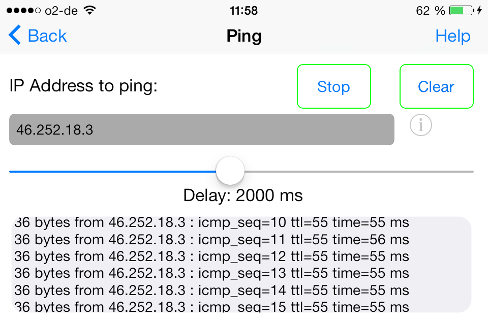
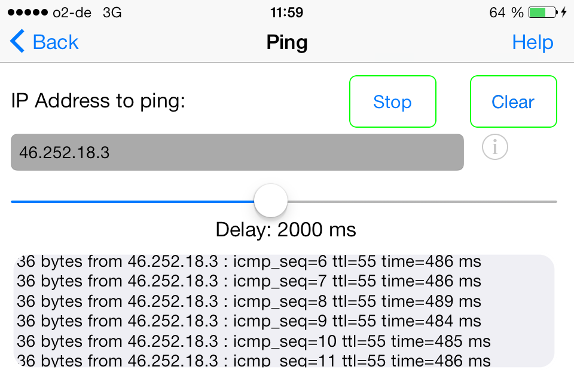
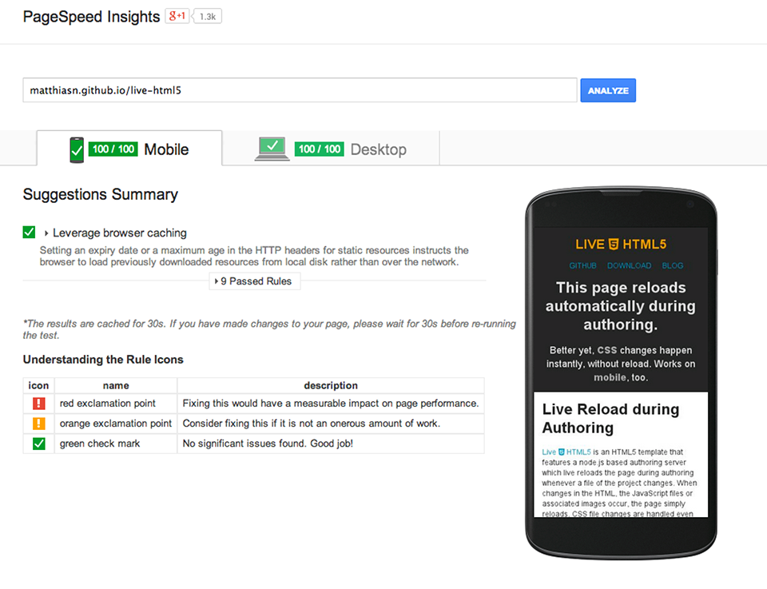

A few weeks ago I started working on the follow-up to my **[BirdWatch](https://github.com/matthiasn/BirdWatch)** project. This new project is another single page application based on **[AngularJS](http://angularjs.org)**, but that is not part of the story I am going to tell you today at all. Instead, today I will talk about **speed**. As in, how long does it take for a web page to load, on a mobile device? I was doing some research by opening different websites under suboptimal conditions, such as 3G with only two to three bars, or even worse the dreaded **E** with four to five bars. Not terribly difficult to simulate, I only need to disable the Wifi and walk into different corners of my apartment for that. Opening my own blog made me sad: with the bad 3G connection it took like **10 seconds** for the index page to show anything at all. No way I would ever wait that long for any page to load. And I would quite likely not even try again. So I went on a quest to make this better. The result is of course on **[GitHub](https://github.com/matthiasn/live-html5)**.

So what happens when the browser loads a page? First a DNS lookup takes place, translating the human-readable domain name into an IP address. Then that domain is contacted using an HTTP GET request for the particular URL. If no specific file is given in the request, a server will usually try to return a file named **index.html** inside the folder that maps to the request URL. This **index.html** then typically contains multiple links to stylesheets and scripts, all of which trigger the same cascade (minus the DNS lookup if subsequent requests point to the same domain). Many of the resources are blocking; the page will only display after they are loaded.

We can examine the request behavior by looking at a timeline chart, like this one for the index page of this blog:

You will notice that the **DOM loaded** event fired after more than an entire second (the blue line), or a little less than 200ms after the blocking screen.css has finished loading.

I have used **[GTmetrix](http://gtmetrix.com)** for generating the charts. The numbers are comparable to what I can measure in Chrome Developer Tools, with a decent DSL subscription. So presumably they are much better than what a suboptimal mobile connection would yield.

Now pre-LTE mobile networks have much longer network round-trip times than copper or fiber-based tethered networks, even under ideal conditions. And things of course do not degrade gracefully when the signal deteriorates.

I wanted to know how much worse network round-trip times actually are on mobile networks, so I measured a **[ping](http://en.wikipedia.org/wiki/Ping_(networking_utility\))** to the domain of this blog with a free iPhone app called **[Ping Lite](https://itunes.apple.com/us/app/network-ping-lite/id289967115)**.

As a baseline measurement, I did the ping over Wi-Fi + DSL and got around 55ms on average:

Interestingly this is about 25ms slower than what I got with the command line ping on my Mac on the same network. I have no idea where this delay comes from, could be something in iOS or in the Ping Lite app. But it doesn't really matter; a 25ms delay is not near as noticeable as the delay introduced by switching to a mobile network. Using 3G under ideal conditions (five bars) I consistently got a little less than 500ms:

That is much worse than the Wi-Fi connection indeed, particularly when multiple files need to be loaded; then these times really add up. Not a big surprise that the Edge connection is even worse, particularly in terms of consistency:

Thinking about the timeline, it is not hard to imagine what influence the higher round-trip times will have on the **DOM loaded** event when potentially multiple blocking requests have to be completed before the browser renders the page.

So what can be improved here? Three things came to my mind:

* Loading external stylesheets takes additional round trips. These are blocking and the page will only render when all the requests are completed. Stylesheets could in theory be loaded asynchronously, but a flash of unstyled content (FOUC) would then occur. Frankly, I'd rather not have the page load at all than subjecting anyone to that. But why not **inline** all of the CSS in the index.html file in the first place?
* No compression was used so far; that alone should cut down the time until **DOM loaded** by substantially shortening the gray portion of the timeline bars.
* The CSS seems fairly **large**; there is no way that 37.8KB of styling are necessary for what is rendered on the page. Add up the computed styles of every single element of the page and you will end up with a few Kilobytes at most. Everything else is dead weight.

So I decided to try inlining custom CSS in the HTML file and then compressing the file using gzip. I was also interested in the fairly new CSS3 **[Flexbox Layout](https://developer.mozilla.org/en-US/docs/Web/Guide/CSS/Flexible_boxes)**, so I decided to write the CSS based on flexbox by hand instead of using **[Bootstrap](http://getbootstrap.com)**. That way I should be able to avoid loading tens of unnecessary stylesheet Kilobytes. You can find out more about flexbox in this great **[tutorial](http://css-tricks.com/snippets/css/a-guide-to-flexbox/)**. Note that everything presented in this article would work equally well with **[Twitter Bootstrap](http://getbootstrap.com)**, particularly when you work with the **[Bootstrap LESS source](https://github.com/twbs/bootstrap), and honestly there is no reason not to. LESS is a delight, I fand that it makes CSS more approachable from a developers perspective. LESS also makes it easy to only include the Bootstrap parts that are used on the page, making the download much smaller. On the other hand, the distribution version of a popular version from a **CDN** (content delivery network) has the advantage that it will quite likely come from the browser cache, considering how ubiquously Bootstrap is used these days. It seems to be a good idea to avoid delivering the distribution version from your own server, particularly when uncompressed and not minified. Waiting for those extra almost 100 Kilobytes will drive visitors away.

At the end, I find either option viable. What I want to avoid isI would just like to bri

But if I decide to deliver the CSS myself, it should be as concise as possible.  

I set up a build system based on **[grunt](http://gruntjs.com)** and started trying out flexbox. It turned out that my frustration tolerance for reloading the page on my mobile devices was so low that I shortly thereafter found myself working on a live **CSS reload** feature. After covering **[Server Sent Events (SSE)](http://dev.w3.org/html5/eventsource/)** more than once on this blog, I thought I might as well utilize SSE for notifying the browser about file system changes. Detecting file system changes is a solved problem, so all it took was transmitting the events to the browser and have a script on the client side initiate a page reload / refresh. To my surprise, SSE support has only **[recently come to Android](http://caniuse.com/eventsource)**, requiring either the KitKat built-in browser, or Chrome for Android version 30. Things worked well with Chrome 30 on Jelly Bean and with mobile Safari on iOS 6 and 7. I cannot say anything about older versions or other browsers. Please report if things fail in your browser, or better submit a fix. 

For the CSS authoring I have chosen **[LESS](http://lesscss.org)** because it makes the whole CSS authoring process a lot smoother. LESS mixins really help in getting rid of a lot of repetition. During the authoring of the page I am using browser-side LESS>>CSS compilation using **[less.js](http://lesscss.org)**. That turned out to be an excellent choice. I stumbled upon the **less.refresh()** function, which has the awesome feature of refreshing the style **without** triggering an entire page reload.

The refresh function combined with the file system refresh messages sent over the SSE connection 
 With that feature, I could really focus on minute changes to the CSS without the page jumping at all, even on the mobile device. The video below will illustrate this nicely. 

Have a look what this means in practice:

    <iframe width="320" height="180" src="http://www.youtube.com/embed/mNxFQva-Shw"></iframe>

Things look decent for flexbox in terms of **[compatibility](http://caniuse.com/flexbox)**. In the mobile world, flexbox has been supported since Android 2.1 and iOS 3.1, and by now it is supported on at least the latest browser version on each platform, which should cover the vast majority of mobile devices out there. On the desktop side of things, flexbox has also been supported for a while on different platforms, even on IE since version 10. This is in contrast to SSE, which Microsoft apparently does not want to support at all. But there is one **caveat**: Flexbox exists in different versions, with the old ones prefixed. For -webkit, even different prefixed versions exist. In itself that is not a huge problem, particularly if you use **[LESS mixins](http://lesscss.org/#-mixins)** so you do not have to continuously repeat yourself. But it is still a quite annoying because it means optimizing for different browser versions. Well, nothing new in the world of browser compatibility issues. 

I spent some time with the flexbox CSS and the layout of the sample index.html in the **[live-html5](https://github.com/matthiasn/live-html5)** project looks fine to me when viewed with the latest versions of all major browsers, but I have not had the time to even out edges in older versions, particularly in Firefox and IE. If you see a problem there, please fix it and submit a pull request. Old browsers have not been the focus of my experiments much. No reason why they shouldn't be supported by the template as well as possible though. Thanks!

Anyways, so all that worked nicely, with a responsive layout with an **aside** element on the right side if the media query detects a wide browser page (e.g. desktop or iPad in landscape orientation) and a stacked layout otherwise. You have seen it in the video above, it is simple and seems to work fine. It is also **[valid HTML5](http://validator.w3.org/check?uri=http%3A%2F%2Fmatthiasn.github.io%2Flive-html5%2F&charset=%28detect+automatically%29&doctype=Inline&group=0)**. 

Finally, when I revisited the page speed issue, I implemented automatic CSS inlining, minification and compression. Grunt is great for that, unless you actually like mindless and repetitive tasks. Have a look at the **[project description](http://matthiasn.github.io/live-html5/)** and **[code](https://github.com/matthiasn/live-html5)** to find out more about the build task. 

Here is the final result of Google PageSpeed Insights after all the automated optimizations:

Great, this is what I wanted to see. Let us have a look at timeline chart for the sample page now. Arguably the complexity of this page is higher than the blog index page, so I think this is a fair comparison:

The **DOM loaded** event now occurs after 86ms, which is more than 12 times faster than what we saw for the index page of the blog initially. It also happens after loading only 7.7KB. That will load much faster over a suboptimal mobile connection for sure. Note that the remaining two resources are not important for the perceived speed. All that matters is the HTML and the embedded styles. The picture is at the bottom of the page on a small screen anyways, and I bet no visitor will give up because a **[font-awesome symbol](http://fontawesome.io)** renders with some delay.

This concludes the quest for speed. The sample page loads as I wanted it to, with nothing less than a 100/100 score on Google PageSpeed Insights. Flexbox seems to work fine particularly for a mobile audience. Finally, the build system removes the pain of optimizing things by hand.

I find the presented solutions particularly sweet as they work together. But you might find individual parts useful as well. I am particularly thinking about the live reload server / client pattern; it will work equally well in a project that uses Bootstrap or whatever. You are not even bound to LESS. You can still use less.js for loading and refreshing CSS without a page refresh. The refreshed CSS could equally well be generated by a **[SASS](http://sass-lang.com)** based CSS build system watching file folders. Or you just edit plain old CSS by hand if that makes you feel good. 

In fact I have made the page refresh feature work with **[Play Framework](http://www.playframework.com)**. For that the server.js will need to be started in whichever folder you want to watch and the script snippet needs do be loaded during development. The script would by default not be allowed to contact the **[server.js](https://github.com/matthiasn/live-html5/blob/master/scripts/server.js)** backend because it runs on a different port. The **[same-origin policy](http://en.wikipedia.org/wiki/Same-origin_policy)** of the browser prohibits this. But an instance of nginx can run in front of both server and serve all resources on the same port, including the Server Sent Event stream. You can find the **[nginx configuration file](https://github.com/matthiasn/live-html5/blob/master/conf/nginx.conf)** in the **conf** folder of the project. This even works with the partial CSS reload feature by loading the CSS file(s) as LESS and embedding the **[less.js](http://lesscss.org)** script. I'd be happy to write an article about this, should the demand present itself.

##Contributions
I am using this particular project to learn more about the technologies involved. Please submit pull requests wherever you see potential for improvements.

##Outlook
In this article I have talked about some implementation details for an optimized delivery of a static page to mobile devices. Along the way I have also presented a convenience feature, the smooth live reload particularly for CSS but also for other resources. 

I can report that this kind of build system and the live reload feature are also useful when building a single page application. In my new project which I have mentioned in the beginning I am taking the reload feature further by also using it for updating the data model. With that, page refreshes based on  data model changes become equally smooth as the CSS refreshes presented here. But more on that in future articles. As usual, you can find the code on **[GitHub](https://github.com/matthiasn/live-html5)**.

Cheers,
Matthias

<iframe width="160" height="400" src="https://leanpub.com/building-a-system-in-clojure/embed" frameborder="0" allowtransparency="true"></iframe>