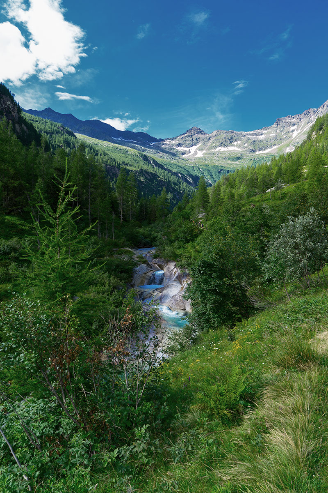
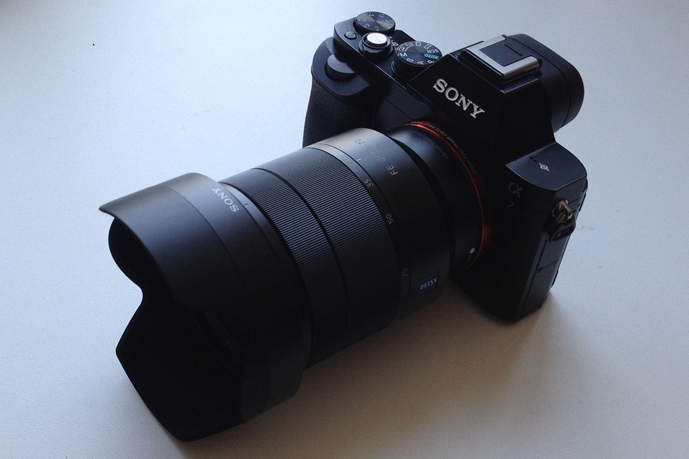

Here's something new to try: a weekly update, covering pretty much of what I keep myself busy with. That may be about what I am reading, learning or currently working on, mostly software-related. In this installment I will discuss monetization, the Hamburg AngularJS meetup and photographing in the mountains while hiking.

# Buying time for more blogging
There's been one thought that keeps coming back. I really like writing this blog, but the problem is that I never seem to have enough time to really focus on it. Now I could try to make more time for it in my free time, but obviously that would be at the expense of my remaining private life. Or I could shift the blogging effort into my working life and get paid to do so. That's quite an attractive thought. How could one go about it? I buy a lot at <a target="_blank" href="http://r.matthiasnehlsen.com/amazon-landing/link">Amazon</a> because I find it really convenient to have my orders delivered the next day and because I have not once had problems sending stuff back that I did not like. Now I usually have an opinion on the stuff I buy, so why not share my thoughts on that? Using the **[Amazon Affiliate Program](https://affiliate-program.amazon.com)**, I can link to the product pages and whenever someone clicks on those links and then buys something within the next 24 hours, a small percentage of the price paid goes to me, the affiliate partner. The same goes for banner ads and such. Sounds like a decent way for the blog to start paying for itself, right?

But not so fast. There is one issue with the approach as outlined above. The Amazon Affiliate Program is on a per country basis. When I simply link to the U.S. store and you are in the United Kingdom and get redirected there, I won't get a commission, even if I have signed up for the program in the UK. Instead, I would have to send you to the UK store in the first place. But how can I do that? How do I detect which country you come from and send you to the appropriate store, should there be one in your country? I would need to do a very fast GeoIP lookup to determine where your IP address is located and then redirect you to your country store. So I **[wrote an application](https://github.com/matthiasn/amzn-geo-lookup)** using **[Play Framework](http://www.playframework.com)** and a local installation of **[freegeoip](http://freegeoip.net)** which looks up the IP address in a few milliseconds and then redirects to the appropriate store. A detailed, tutorial-style article on that application will follow soon. Maybe others will find this useful as well.

# The first Hamburg AngularJS meetup
Okay, this was technically last week, but there was no weekly review in place back then. So the **[first session of the Hamburg AngularJS meetup](http://www.meetup.com/Hamburg-AngularJS-Meetup/events/193495902/)** that I founded recently (see **[this article](http://matthiasnehlsen.com/blog/2014/07/08/hamburg-angularjs-meetup/)**) went great, it was fun to meet and solve a problem together. I had found a sponsor for the meetup, **[Packt Publisher](https://www.packtpub.com)**, and they were kind enough to provide some free ebooks that could be given away during the meetup. So I thought, why not do a raffle so that everyone gets a fair chance? Then I thought, why not build an **[AngularJS](http://angularjs.org)** application together and use it to draw the winning tickets in the raffle.

We had a total of four ebooks to give away, two each of these: 

<iframe style="width:120px;height:240px;" marginwidth="0" marginheight="0" scrolling="no" frameborder="0" src="http://r.matthiasnehlsen.com/mastering-angular/iframe">
</iframe>

<iframe style="width:120px;height:240px;" marginwidth="0" marginheight="0" scrolling="no" frameborder="0" src="http://r.matthiasnehlsen.com/angular-directives/iframe">
</iframe>

I reserved one for the volunteer who was willing to do the coding on the big screen so there were three more to draw with the application we were about to build. Then as a group we discussed the options of how to go about this and that worked really well. We wrote a web application for drawing the three winners and we even wrote tests for the application.

I am looking forward to the **[next session on August 21st](http://www.meetup.com/Hamburg-AngularJS-Meetup/events/196972082/)**, which is already fully booked. On that note, last time all 20 spots were snapped up and there was a waiting list with an additional 10 members. But we were "only" 13 who actually showed up. I wonder how best to deal with that. It's not a problem if people don't come, but they could at least change the RSVP as soon as possible. On the other hand, I have to admit that I have done the same in the past - sign up for something free and then neither show up nor change the RSVP. Maybe the best way would be to simply increase the number of spots and plan for a percentage of **[no-shows](http://www.merriam-webster.com/dictionary/no-show)**? That's working for airlines, why should it not work here? Maybe, to be on the safe side, I should plan for 25% no-shows and then just increase the number of spots accordingly?

# The mountains / photography
I am back already. The weather turned quite bad and I wasn't in the mood to get struck by lightning while on top of a mountain. Still, it was great and I am looking forward to the next time. I had my camera with me - a **Sony A7** full frame that by itself is a surprisingly compact camera. As a lens, I had the **Zeiss 24-70 OSS 4.0** lens - which I hoped would be a good combination for travel photography. Here are some examples:

If you're interested, here is the image in the **[original resolution](/images/photography/DSC02249-full.jpg)**. It is not the original image, but rather the processed version I used when I ordered a larger-format print. If anyone is interested in the post processing in Photoshop, let me know. The same goes for the next image, with the original resolution **[here](/images/photography/DSC02231-full.jpg)**.

Overall, I am happy with the image quality, but it is below the quality of images taken with fixed focal length lenses. Usually I don't use zoom lenses at all, so I would mostly use this lens when traveling. But is it really a good travel lens? No, I don't think so. It is way too bulky:

I only got to use it ever so often as it had to go into the backpack because of its large size. That's kinda pointless when you are hiking with other people. Once you find your pace, you don't like to stop for that guy with the bulky camera, so you don't. Meaning, I fell behind and ended up taking way more photos with my smart phone because that was always handy. Couldn't I simply have taken these particular photos with the smart phone? Not a chance - besides the better image quality, the Zeiss lens also has a much more wide angle than the one in the smart phone.

So the Zeiss lens goes back to Amazon tomorrow for a refund. I don’t think the lens is bad actually. I just don’t use zoom lenses that often; if possible, I prefer fixed focal length lenses. If you like to use a zoom lens, this one might serve you well. It is by all means better than the plastic kit lens. That one's just plain awful. While traveling, though, this lens proved to be too bulky for my taste.

I think I have an idea for a better travel lens, but more on that another time. For those interested in the equipment mentioned above, here are the links:

<iframe style="width:120px;height:240px;" marginwidth="0" marginheight="0" scrolling="no" frameborder="0" src="http://r.matthiasnehlsen.com/sony-a7/iframe">
</iframe>

<iframe style="width:120px;height:240px;" marginwidth="0" marginheight="0" scrolling="no" frameborder="0" src="http://r.matthiasnehlsen.com/zeiss-24-70/iframe">
</iframe>

The camera is really great, by the way, I do not regret that purchase at all. The menu might not be the greatest, but for this form factor the image quality is unbeatable, unless you use the more expensive **[A7R](http://r.matthiasnehlsen.com/sony-a7r/link)**. But I do not usually need **36MP**.

Cheers,
Matthias

<iframe width="160" height="400" src="https://leanpub.com/building-a-system-in-clojure/embed" frameborder="0" allowtransparency="true"></iframe>