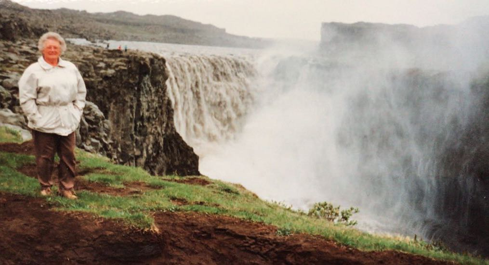
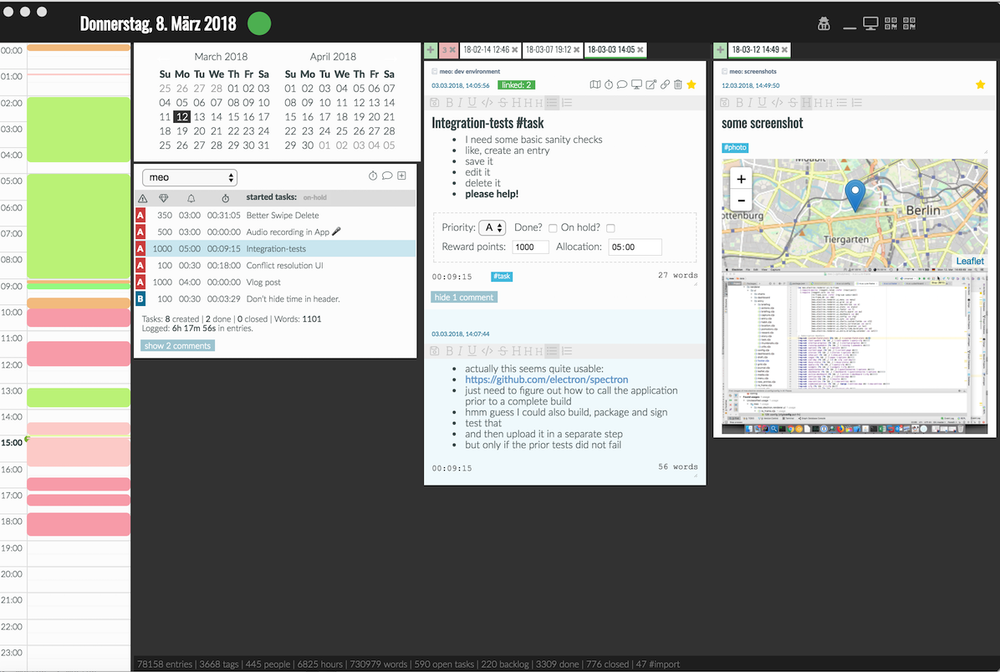
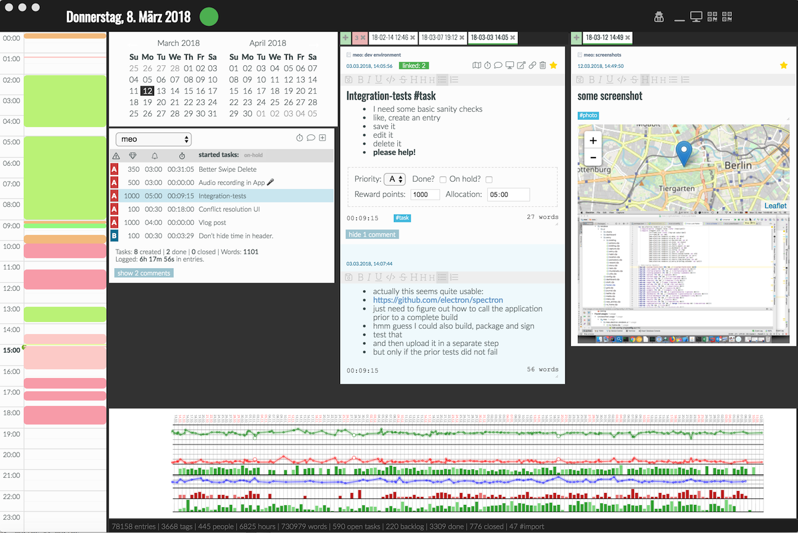
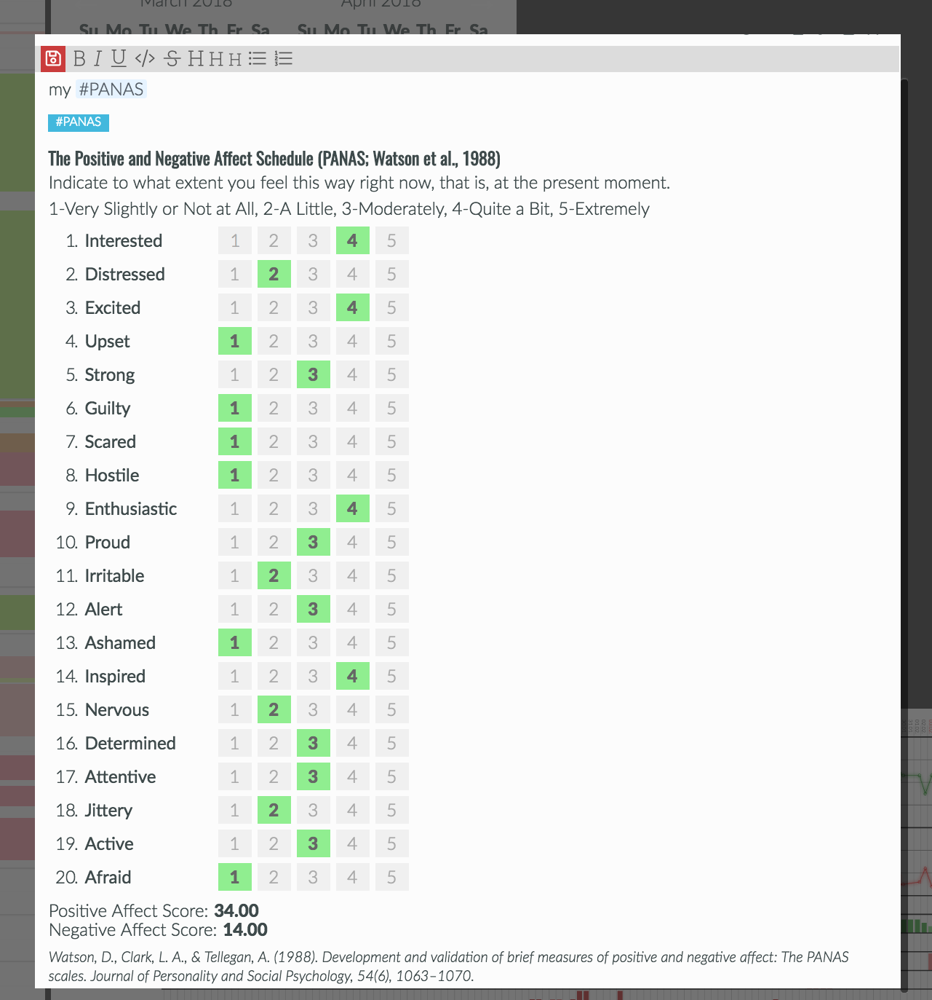
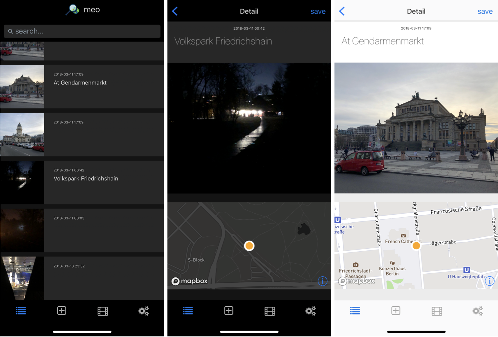
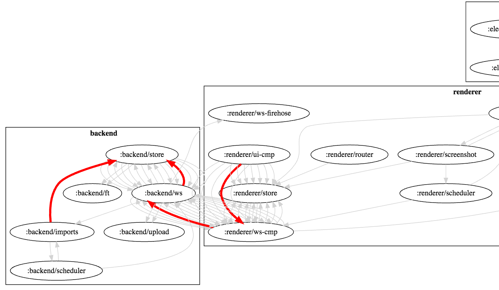
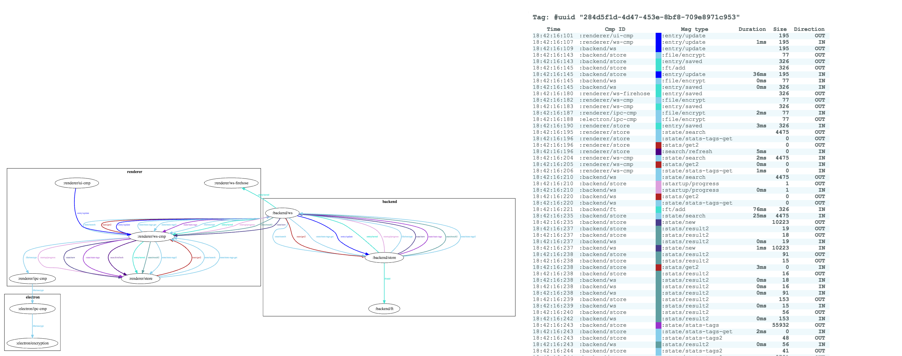

I would like to dedicate this blog post to my **grandma**. She just turned 94. Happy birthday, Grandma, I love you. This is a perfect time for introducing **[meo](https://github.com/matthiasn/meo)**, a [Clojure](https://clojure.org/)/[ClojureScript](https://clojurescript.org/) project that she inspired. About two years ago, she showed me a few photos from a trip to **Iceland**, including this one:

 I asked her what year that was. She did not remember but retrieved a folder, scanned a few pages, and less than a minute later reported the details of the trip - it was in May 1987. I was stunned, as it dawned on me that I did not have anything like that for the past 20 years of my life, in which I visited 39 countries. Emails with itineraries, photos with geolocation for a few years back, sure, but all very fragmented, and far from me being able to give a concise summary of any of those trips in 60 seconds or less. I told her I wish I had recordings like that, and she said, 'Really? I wish I had recorded more.'

That made me think hard about the problem of getting older and forgetting more and more. I had always wanted a journal, but using paper wasn't an option. I cannot even read my own handwriting, or at least find it very unpleasant. Also, paper-based notes have physical weight, plus indexing them sucks. I wanted a digital journal instead, one that runs on both desktop and mobile, and that does not require me to hand my recordings over to interested third parties. 

Nope, journals must be (and stay) private. Also, it would have to be an open-source tool so that anyone can check what it does with your data. I have zero reason to take anyone by their word on how they will respect my privacy. Maybe they mean it as of today, but through either neglect or change of mind, they will probably still sell or lose my data at some point, especially if it's a free service that struggles to find a business model while dealing with increasing infrastructure costs. What if there was an application that does not share your information with anyone? **[meo](https://github.com/matthiasn/meo)** wants to be this project, but first, I would like people smarter than me to review it, and point out where it can be improved and made more secure before making it generally available as a packaged thing [^1]. You can use it now if you don't mind building it yourself, though. Here's how the desktop application currently looks like:

Meo is an intelligent, data-driven journal. Initially, I just used it for recording text and photos together with my exact whereabouts at the time. But I pretty soon realized that I would not necessarily spend much time on keeping a journal just so that I could benefit in some rather distant future. I knew I would enjoy having more information about my current life in that distant future, but the process of collecting data would also have to be helpful in the now. [^2] I always found it to be a waste of data to throw away notes on tasks and their completion, and I also read '[The Effective Executive](https://www.harpercollins.com/9780060833459/the-effective-executive)' by Peter Drucker at the time. The chapter 'Know Thy Time' where he suggests recording how you spend your time inspired me in particular. I wanted that, only built into my journal and recording how I spend my time all through the year(s), instead of recording stuff on paper for weeks at a time. 

For that, I can define tasks in **[meo](https://github.com/matthiasn/meo)** and then have a timer running whenever I work on a given task. Each task then belongs to a story, and those, in turn, belong to a few broad sagas. By looking at time recorded per story or saga, I always have a view into how I spend my time, which is quite often different from what I thought. So far I have completed 3309 tasks this way, recording 6825 hours total, which does include sleep, and by just recording the process of being me, I already have a pretty detailed journal. After all, to a large degree, **I am what I do**. I have heard the counterargument a few times that what someone did in their life was so mundane and boring that it would not be worth recording. Well, in that case, they have a much bigger problem... 

Also, I am not trying to optimize myself towards getting more and more done. My task backlog is currently 590 items long and I am under no illusion that I will ever get that down to zero - but if I cannot complete all tasks, I will likely fare best by spending my limited time working on the most relevant ones. I have a few ideas on how to come up with a better sort order than by time or some BS priority, but more about that later when I have a proof of concept for that.

On the left side in the screenshot, there is a calendar that shows me how I really spent my time, not what was planned. Of course there normally are labels, but I can also switch them off. [^3] In the next column to the right, there is a list of work in progress, filtered for a particular saga or overall. Here, I am only showing the work in progress for meo. Then to the right, there is the selected task, with its comments and the time recorded. Then all the way over to the right, there are linked entries. In this case, there is a linked screenshot. Oh yeah, you can take screenshots in **[meo](https://github.com/matthiasn/meo)** using **⌘-P** and they will be recorded with time, your whereabouts, and whatever comment you might have. All the way to the right, you can see such a screenshot. I find screenshots for documenting the progress of programming super useful without taking much extra time, and I've taken a few thousand of those so far. Then later when I come back to a task or project, those screenshots often make it easier to get my mind back into the problem. In a way, that's an onboarding problem, only on a smaller scale.

Then I thought I would like to record additional information about myself, for example, steps per day, flights of stairs climbed, amount of certain vitamins and minerals taken, blood pressure, weight, amounts of coffee, beer, whatever, just to see if it's useful. A lot of that is automated [^4], so it is really not that much of an effort. And yeah, some of that information really is useful, and why not collect it as long as it stays with me. No, I would not share this kind of information with any cloud-based service. But for **m**y **e**yes **o**nly, why not.

Here's how that looks like, with the labels omitted again, because hey, most of that is none of your business:

In other contexts, companies pay money for banner ads, so I assume they are proven to work. Only that here, the banner ad, being about myself, is far more relevant to my life than any commercial advertisement could ever be. I want to spend more time in the future on relevant calls to action in both those banner ads on the desktop and notifications on mobile. It already helps me to see that I have multiple days in a row where I have walked over 10K steps, and that then motivates me to keep going, but there is a lot more potential. For example, the application could tell me to go for a walk after the completion of a task when I'm nowhere near being on track for meeting my daily goal.

A part of my motivation for writing **[meo](https://github.com/matthiasn/meo)** was that it could be an example application for a book I started a few years back about building systems in Clojure [^5]. But I soon realized that I could not write a book that is authoritative about any of this. I was learning so much new stuff all the time. And then it never felt like a good time to take a snapshot and write about it, knowing that it would likely change. And then that was not the only thing I felt bad about, so I thought why not also track my mood, as it seemed to me that something was not going well there.

I researched a few psychological instruments for assessing current mood. I'm by no means an expert on any of that, but what seemed to make sense to me is the [PANAS](https://en.wikipedia.org/wiki/Positive_and_Negative_Affect_Schedule), an instrument for assessing the momentary affective situation. There are 20 terms, for each of which the subject selects a value on a 5-item Likert scale. In the end, it gives you a positive and a negative score. The score probably also means something in comparison to the general population, but for me, it was most interesting to observe changes over time, and I found some patterns in my recorded data that make me unusually well-informed when talking to mental health professionals, including friends in that field.

Here's how filling out the **PANAS** looks like: 

I found that most questionnaires work in a similar way, with a [Likert scale](https://en.wikipedia.org/wiki/Likert_scale), some of the items reversed, and any number of scores derived from filling out the questionnaire. Those can now be defined in **[meo](https://github.com/matthiasn/meo)** via configuration as an edn-file, but ideally, there should be a graphical user interface for defining and editing surveys. Pull requests most undoubtedly welcome.

The data for filled out questionnaires is then plotted against other collected data, as in the screenshot further up. I am frequently using other such instruments as well, like the [CFQ11](https://academic.oup.com/occmed/article/65/1/86/1433061) for signs of fatigue - this is the blue line in the chart above. I will write more about data gathering, questionnaires and charts another time - for today I'm just giving a brief overview of different parts of the project. 

The desktop application of meo is written in [Clojure](https://clojure.org/) and [ClojureScript](https://clojurescript.org/) and uses [Electron](https://electronjs.org/), which makes the whole thing platform-independent. I use it on a MacBook all the time and have used it on Linux and Windows in the past, albeit briefly. Those may have broken in the meantime, though. Please check if you can run it yourself by following the steps in the README, and file an issue for whatever comes up.

## The mobile app

Next, there is a mobile application. Initially, I started with an [iOS app written in Swift](https://github.com/matthiasn/meoSwift) but that was never complete, and only did a few things, like collecting geo information whenever there was a significant location change, capturing text notes, or uploading photos. It uploaded it's data to the **[meo](https://github.com/matthiasn/meo)** desktop application by scanning a [QR code](https://en.wikipedia.org/wiki/QR_code), and then sent the data over the local network, but that was never really a good idea. The novelty of scanning that code wore off quickly, and it just got tedious. Also, it would lead to problems in the review process why the app would require either unencrypted traffic or using a self-signed certificate. And then that app would be iOS only, and my vision is to be multi-platform on both desktop and mobile, not least because I do not want to lock myself in but have the option to move to any platform at any point.

So I built a mobile app in ClojureScript on top of [React Native](http://facebook.github.io/react-native/). At this point, one can record text entries, import data from Apple Health, and photos, all of which are then synced one direction to the desktop application, using a user-provided WebDAV folder, and then passes journal entries inside AES-256 encrypted files. Entries on mobile can also be edited, and updates are then synced. Conflicts are detected using a vector clock, which is mostly thanks to [Tyler Neely](https://github.com/spacejam), who provided the theory and guided the implementation. Right now, conflicts are only shown, and there still needs to be a UI for resolving them. Syncing should also work both ways. And the structure of my code is still quite convoluted. I wish my days were longer, then I would probably spend a lot more time in this area. Overall, the code quality here really needs to be improved. Anyway, this is how the app currently looks like, with both a light and a dark theme:

If you think all this makes sense and you believe in the idea that we should be able to record stuff about our lives without other parties eavesdropping in on that, and that a tool for doing so should be open source, then please subscribe to the mailing list at the bottom of the page so I can keep you updated on the development progress, and when both desktop and mobile applications will be released. Of course it would help the most if you became an active contributor, but you can also help finding collaborators by sharing this article. Thank you. Now for the more technical side of things.

## The technical side

If the above applies, and you also want to learn [Clojure](https://clojure.org/) and [ClojureScript](https://clojurescript.org/) - or you know these excellent languages already - then I would like to ask you for help in making the code base better. Help can happen by reviewing existing code, pointing out weaknesses and repetitiveness, improved test coverage, UI integration tests, and overall code quality improvements, or by solving or helping in solving upcoming problems. Or, if you are a designer and think something like this should exist, only in pretty, I would love to hear your thoughts, or even better, see your SASS magic in a pull request. But also guidance in, 'Hey, this looks terrible, here's an idea to make it better' would be very welcome.

I have built a tool that hopefully helps in onboarding anyone who is interested in collaborating, and it is called [inspect](https://github.com/matthiasn/inspect). It's a tool for looking inside a running application built on top of the [systems-toolbox](https://github.com/matthiasn/systems-toolbox). This is a library I built quite some time ago, with the vision of building something like inspect, but lacking the skills to do so back at the time. Working on **[meo](https://github.com/matthiasn/meo)** and the electron application around it eventually enabled me to build a first standalone desktop version of inspect. Systems on top of the systems-toolbox have a so called firehose where, when enabled, all message flows are copied to, and persisted, for example on a Kafka topic. Inspect then consumes this Kafka topic and groups message flows together for visualization, and also infers the structure of the system from successful message flows it observed. Here's the overall structure of [meo](https://github.com/matthiasn/meo), as seen by [inspect](https://github.com/matthiasn/inspect):

Here with the communication for a selected message type:

Here's a particular flow for taking a screenshot, which involves the main electron process, the renderer process, and the JVM "backend" application they talk to. 

It looks convoluted because it is, and I have not had the time to simplify it yet. But at least there's a tool for visualizing the madness, which is something I wish more projects had. I will talk more about this tool in subsequent blog posts. While many areas in the **[meo](https://github.com/matthiasn/meo)** codebase still suck, at least there is visibility like this, and that's kinda fun. But there is also plenty room for improvement in inspect, so if that interests you, please help in making this more useful and/or prettier. For example, it would be cool if my coworkers wouldn't always make fun of me that my laptop was about to take off when I use inspect. The system that upon inspection makes my laptop fans max out processes a lot more data and runs on more than ten nodes, but I think that nonetheless there are better solutions that would not max out the render process in Electron. This is yet another area where fresh sets of eyes would be helpful.

I'm happy and grateful that my grandma is still around to see this article about what she inspired. Her birthday helped me coming to terms with the idea of talking about this project. It's probably true what Reid Hoffmann said, 'If you are not embarrassed by the first version of your product, you've launched too late.' And I'm still fairly embarrassed, and without grandma's birthday, I probably would have tried to keep polishing stuff until the end of time, so thanks for that, too, dear grandma.

Thanks for reading. Let me know if you have any questions [^6] or comments. You can subscribe below if you want to hear about progress. Please share this post if you want to help me find great collaborators. With help, **meo** can be launched much sooner - plus I'm tired of working on this project all by myself.

Until next time,
Matthias

[^1]: Code review is one of the many areas where I am looking for collaborators. I'm particularly curious about my choice for encryption, and if I made sane choices, and improve them where I did not.

[^2]: Today, with a journal going back almost two years, I already enjoy it a lot to go back to random days in those past years and see what was going on in my life at that point in time. 

[^3]: There's a private mode for that, something I can toggle, for example at work - or when I want to take screenshots.

[^4]: Currently, everything from Apple Health is imported automatically - anyone out there who want's to help make this available on Android?

[^5]: You can find the book [here](https://leanpub.com/building-a-system-in-clojure). Don't buy it yet, unless you want to use your purchase as a way to buy me time to continue working on it (and meo). Or buy it but don't spend too much time on reading it yet, as most of it will have to be rewritten anyway.

[^6]: My email address is on my [GitHub](https://github.com/matthiasn) profile.