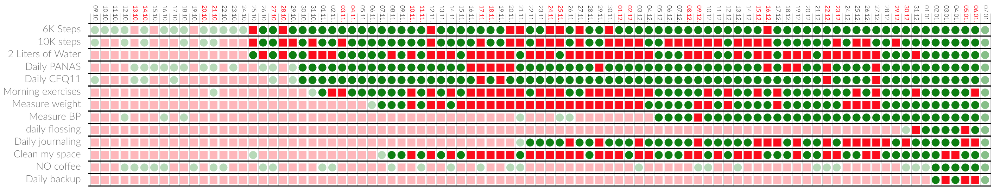

The **open-source** application[^1] **meins**[^2] is an experimentation toolkit for **designing your life**. It helps you collect relevant information,  design, and then implement change. Most importantly, it does so without leaking data, because everything stays within your realm of control, and you can always verify this claim in the [source code](https://github.com/matthiasn/meo). Please have a look at the [manual](https://github.com/matthiasn/meo/blob/master/doc/manual.md) to find out more about what it does. The same text is available in the application under the help menu.

Among other things, you can use **habits** to get yourself to do something, where a habit is a set of rules, simple to complex, but with a simple outcome - you either succeed for a particular day, or you fail. Here's how that looks like for a select subset of **my habits**, for the past 90 days:

It's fun to turn the day green, and helpful for the things I said I would do, too. There are more charts, but today it's enough to focus on just this one, and it is transforming my life already. This is most noticeable to me through transforming my body. You will be surprised what push-ups, pull-ups, sit-ups and so on do when you actually do them, every day, and that does not even take ten minutes.

You can download a **beta version** of the application for Linux, Mac, and Windows on [GitHub](https://github.com/matthiasn/meins/releases), where you want the highest existing version for your platform. Maybe this an excellent opportunity to give your New Year's a second chance. The Mac version is usually the newest, and the others can lag. You only have to download the binary once, as there are automatic updates. You can also build the application yourself, with a simple [make](https://www.gnu.org/software/make) command, plus an unknowable amount of time for getting your development environment right.

I've been working on **meins** for the past 2.5 years, mostly as a side project - also fulltime between projects - and it's been great fun. However, I feel like I start burning out. It's also a bit lonely to work on something like this all by yourself. And this where you come in. If you like. 

# How can you help?

- You can pick up **[issues on GitHub](https://github.com/matthiasn/meins/issues)** and work on solutions in **[Clojure](https://clojure.org)** and **[ClojureScript](https://clojurescript.org)**. Alternatively, work on simplifying the code, or provide tests. There is plenty to do. Some issues exciting, some not so much.

- You can do the same but for **CSS**/**[SASS](https://sass-lang.com/)**. The stylesheets are a bit of a mess and frequently trip me up.

- You can use the application, provide feedback and report bugs.

In case that none of these options apply for you at this point, but you are curious where this project will go and want it to develop further, please share this post to help me find the people who can help.

Thank you very much,
Matthias

[^1]: **meins** is written almost entirely in **Clojure** and **ClojureScript**. I find it nearly impossible to believe that I could have written it in any other language in anywhere near the same amount of time. Discovering Clojure back in 2012 is hands down the best thing that happened to me since I started programming, language-wise.
[^2]: The word **meins** is the German possessive pronoun that signifies that something is **mine** - almost the same word as in English. The application used to be named [meo](http://matthiasnehlsen.com/blog/2018/06/15/meo-beta/), but the name turned out to be unfortunate. More about that another time, maybe.

