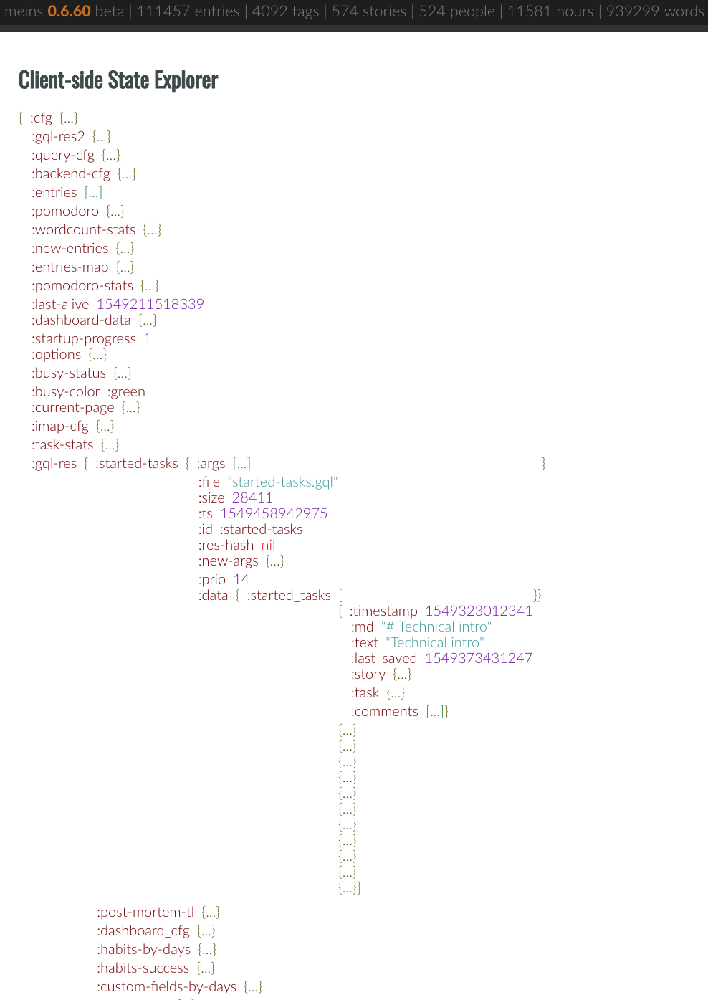
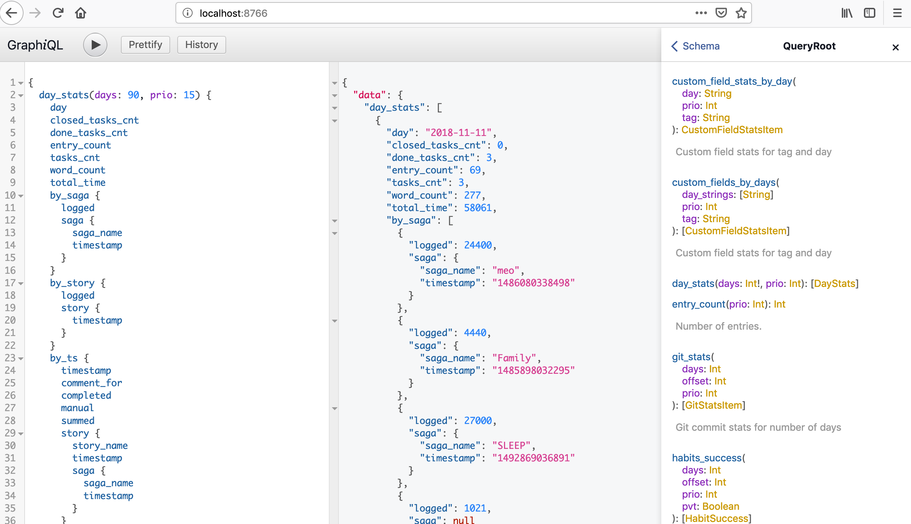

This is a report on how I built an intelligent journal as a desktop application in [Clojure](https://clojure.org) and [ClojureScript](https://clojurescript.org/). The description of the mobile app will follow. We got a lot to cover, so let's dive right in. I needed a tool that would help me get my life in order, as an intelligent journal and without giving my data away. You can read about the motivation in this [article](https://matthiasnehlsen.com/blog/2018/03/15/introducing-meo/). Data integrity was also an important consideration, especially since I did not want to rely on any cloud storage. That application did not exist, so I built it in [Clojure](https://clojure.org), which is my favorite programming language. It is currently called [meins](https://github.com/matthiasn/meins) and I will describe its architecture in this post. In the process, I will show you a way to build a **desktop application** in [Clojure](https://clojure.org) and [ClojureScript](https://clojurescript.org/), with an [Electron](https://electronjs.org/) application, written in [ClojureScript](https://clojurescript.org/), and a **JVM** process doing typical backend work such as persistence and maintaining a searchable index, where the Electron application runs the JVM process in the background. You should be able to build any other desktop application in Clojure and ClojureScript using the same building blocks, with or without a JVM backend. 

On the lowest level there is the [systems-toolbox](https://github.com/matthiasn/systems-toolbox) library. It lets you build larger systems out of communicating components, which are heavily inspired by the [actor model](https://en.wikipedia.org/wiki/Actor_model), with one difference that actors here need not know where they send messages, but instead just place a message on a channel, completely oblivious of what happens going forward.[^1] 

Components also hold some managed state inside an atom. State changes will be broadcast as snapshots so that other components can observe the state. This is useful for example when rendering a user interface based on these snapshots.

Such actors or components then get wired together by the so-called **switchboard**, which is a component instantiates components and connects them, all based on messages it receives. This could be way more dynamic, but so far I am only using this mechanism when firing up a system. Then, a larger system will emerge when multiple such systems communicate, for example via [Websockets](https://github.com/matthiasn/systems-toolbox-sente) and [Node IPC](https://github.com/matthiasn/systems-toolbox-electron) here, or also [Kafka](https://github.com/matthiasn/systems-toolbox-kafka) or [Redis](https://github.com/matthiasn/systems-toolbox-redis) (as a queue). 

As those emerging systems become larger, I find it more and more difficult to build an appropriate mental model from code alone. I thought that systems should assist me in my mental reasoning about them, beyond some logging, and some outdated, half-hearted design documents rotting in confluence. No, I'd rather look inside a running system and see what really happens, and build my mental model from what **is**, as opposed to my flawed beliefs about what the code **might do**.

You can find some of my ideas around observable systems in [inspect](https://github.com/matthiasn/inspect), which visualizes a running system and infers its structure through observing message flows. When activated, a system puts all messages it observes on the so called **firehose**, which can then be written to a file, or also put on a Kafka topic, or whatever else you want to write an adaptor for. In this case here, I use a simple append log, which **inspect** can then [tail](https://en.wikipedia.org/wiki/Tail_(Unix)) and examine independently.

This is [meins](https://github.com/matthiasn/meins), as seen by **inspect**, and only inferred from message flows and not at all from code or configuration:

I'll show you how to use it later. For now, this automatically generated drawing provides a good starting point to dive into the architecture. There are **three subsystems** here. 

On the left, there is the **backend** subsystem. Most of the relevant logic in the backend resides in the `:backend/store` component, which persist each journal entry into an append log for each day. Just like any other component, the `:backend/store` component only processes a single message at a time and there is only a single store component, which guarantees that there is no chance of multiple threads writing to the file at the same time. On application startup, the logs are simply replayed, as a **complete rebuild** in the [Event Sourcing](https://martinfowler.com/eaaDev/EventSourcing.html) sense. Then, the `:backend/store` holds an **in-memory index**, modeled as a **graph** using [ubergraph](https://github.com/Engelberg/ubergraph), which can be queried at runtime using [GraphQL](https://graphql.org/), where [Lacinia](https://github.com/walmartlabs/lacinia) provides the execution engine. This subsystem communicates with the renderer process using Websockets, provided by the [systems-toolbox-sente](https://github.com/matthiasn/systems-toolbox-sente) library. The usage of Websockets or any other means of transport between components is transparent to the individual component. Components just put their messages on a conveyor belt and are done with their job.

In the middle, there is the **renderer** subsystem. This is a client-side [ClojureScript](https://clojurescript.org/) application running inside an [Electron renderer](https://electronjs.org/docs/tutorial/application-architecture) process, which is based on [Chromium](https://www.chromium.org/) and behaves like a browser window, with some additional features. Here, the UI is rendered using [reagent](https://github.com/reagent-project/reagent) and [re-frame](https://github.com/Day8/re-frame). Communication between components is once again provided by the [systems-toolbox](https://github.com/matthiasn/systems-toolbox) library, and (non-UI) components look the exact same on the **JVM** and in **ClojureScript**. The user interface sends queries to the backend, both in [GraphQL](https://graphql.org/) and as adhoc queries. These request messages are relayed to the backend using Websockets, once again using a component from the [systems-toolbox-sente](https://github.com/matthiasn/systems-toolbox-sente) library.

On the right, there is the **main** subsystem, which is yet another ClojureScript application, this time running inside the [Electron main](https://electronjs.org/docs/tutorial/application-architecture) process, which fires up both the **backend** and the **renderer** subsystems, and provides some platform interop such as providing the application menu or listening to key combinations. There's also a component for capturing screenshots. Communication between components in the renderer and the main process is provided by the [systems-toolbox-electron](https://github.com/matthiasn/systems-toolbox-electron), which provides communication between processes that is similar to systems-toolbox-sente, except for the transport which is **Node IPC** instead of Websockets. Once again, components do not need to know any of this. There is some wiring between them and the communication component, and if the communication component is set up to relay a particular message type, it will do so.

After this brief introduction, you already know enough to start exploring the system yourself. All you need to do is download [meins](https://github.com/matthiasn/meins/releases), and then click **_Dev > Start Firehose_**. Then, download [inspect](https://github.com/matthiasn/inspect/releases/) and point it at `/tmp/meins-firehose.fh` using **_File > Open File_**. Go over to **meins** and click **_File > New Entry_**. Inspect should have automatically cartographed the application, as it has seen it thus far. Then, you can examine the data further, e.g. highlight a particular message type:

Or, further on the right, you can select specific message flow, and see what other message types were involved, and how. Here's the message flow for all messages triggered by saving a journal entry:

Next, there is a chronological list of all individual messages involved. To the right, you can look inside individual messages:

Overall, I find that such an interactive visualization quite helpful, not only when debugging message flows but also when trying to understand a system better in general. It's nice to have the system pitch in and document itself, as opposed to only having to rely on outdated documentation.

After looking inside the packaged version, you may want to fire up a development instance of **meins**. For that, you must have the following installed and running:

* [Leiningen](https://leiningen.org/)
* [Node v10+](https://nodejs.org/)
* [Yarn](https://yarnpkg.com/)
* [JDK 10+](https://openjdk.java.net/)

Once you have the required tools set up, go to the cloned repository of meins and run once:

    yarn install
    lein cljs-main

Then, run the following in parallel:

    lein run
    lein cljs-figwheel
    lein sass4clj auto

When all of these have started, run:

    npm start

An instance of **meins** should fire up that looks like the packaged version, except that the title is now _electron_ instead of _meins_. This development instance uses [Figwheel](https://github.com/bhauman/lein-figwheel), which means that changes in the UI code will be reflected immediately. Let's try this out. 

Go to namespace `meins.electron.renderer.ui.grid` and look for the string `"add tab"` and change the label text to `"add first tab"`. The UI should change almost immediately after saving the file.

## The Frontend

Now that you have the environment running, let's continue exploring the codebase. The renderer subsystem has two major parts, the client-side state and the ui component. The store component manages the state and has handler functions that handle particular message types, and contain the business logic around the respective message flow.

The ui component then subscribes to the application state and re-renders whenever something changes. Let's have a look at the client-side wiring:

`gist:8f67e8cfa662403fe525a23f90eadab6?file=meins.electron.renderer.core.cljs&highlights=61,63-74,76-134`

First, we have the **switchboard**, which will facilitate instantiation and wiring of components. Below, a set of components or rather their **blueprints** is defined. Each of the function calls returns a map that contains the component ID and optionally a state function that can set up the component state (otherwise it's just an empty map) and a map of handler functions, one for each message type that the component should handle. Message types are namespaced keywords. The systems-toolbox then uses [spec](https://clojure.org/guides/spec) to validate messages, which gives some of the benefits of a typesystem, but with less of the downside of making systems too rigid and resilient to change.

 Then in the next step, in the `init` function, components are instantiated by sending a `:cmd/init-comp` message with the set of components as the payload, and then wired together using `:cmd/route` messages, upon which the switchboard will create communication channels between the out-channel of every component under `:from` and the in-channel of every component under `:to`, for every message type that is handled. Thanks to inspect, we already know how that wiring looks like.

Then, there is the `:cmd/observe-state` message type, which allows a component to watch the state of another component. Then, whenever anything in the observed component changes, the observer will receive a snapshot of the state. In this case, the state snapshot will be rendered into a user interface. The UI then has no way to alter this state directly, it can only send messages to the store component and then be notified with a fresh snapshot when its state changes. This provides for a nice separation of concerns, where state changes happen in exactly one place. 

The `:renderer/store` component is a little more complex, let's just look at the blueprint map, which points us at the individual handler functions for each message type, plus the `state-fn` which gives the component its initial state:

`gist:fe1b1492b85b6eb059fce1cd6d6d7597?file=meins.electron.renderer.client-store.cljc&highlights=12,31,35`

In the `state-fn`, you can get an idea what the initial component state will look like. However, as more and more handler functions return an updated state after processing different message types, it becomes more and more difficult to infer from the code alone how the state will have changed. In order to assist during development, there is a built-in way to have a look at the component state. It is called the **data explorer**[^2] and you can access it using either `CMD-D` on Mac or `Ctrl-D` on Linux and Windows, or via **_Dev > Toggle Data Explorer_** in the menu. This is how that looks like:

The data explorer is quite helpful when examining what happens in the frontend. It would also be helpful to have something similar for the backend state. That in particular does not exist yet, but the backend offers yet another way to examine the running application by interactively building GraphQL queries and and then executing them. We will get to that in a little bit. Let's have a look at a handler function first.

A handler function is a function that takes a single map and that return a single map. The map passed to handler contains the following keys:

* `:msg` - the entire message vector
* `:msg-type` - the message type, which is a namespaced keyword. This is the first element in `:msg`
* `:msg-payload` - the payload of the `:msg`, which is the second element in the message vector
* `:msg-meta` - meta data about the message flow, such as the tag and timing, which is then used inspect, or also a connection UID when using WebSockets over [sente](https://github.com/ptaoussanis/sente). More broadly, the meta data is for information about the message flow, as opposed to the payload itself
* `:current-state` - a snapshot of the component state
* `:cmp-state` - the component state atom, which can be updated using `swap!` or `reset!`. This is useful for example when you want to do something to the sata after returning from the handler, as would be the case inside a future.
* `:put-fn` - a function for emitting messages. Messages can be emitted by a component through either using the `put-fn` or returning the message(s) from the handler function.

When a handler function returns, a map is expected. It can be empty, which means that there are neither messages to emit nor a change in component state. Optionally, the map can contain the following keys:

* `:new-state` - the new component state after the handler has completed its work
* `:emit-msg` - a vector with messages to emit after the handler completed its work
* `:send-to-self` - a vector of messages to send to the component itself.

Here's a simple example for a handler function, the `refresh-cfg` function in the `meins.jvm.store.cfg` namespace:

`gist:d7dff86619dc9759f71466354f3cd771?file=cfg.clj`

## The Backend

The backend runs inside a custom JVM, assembled by [jlink](https://docs.oracle.com/javase/10/tools/jlink.htm). It holds the application state with all journal entries inside a graph, which is an [ubergraph](https://github.com/Engelberg/ubergraph) data structure. This graph data structure is then traversed inside [Lacinia's Field Resolvers](https://lacinia.readthedocs.io/en/latest/resolve/index.html) when the UI sends [GraphQL](https://graphql.org/) queries to the backend. 

You can dynamically explore the schema, the queries, and your data in a browser. This functionality is provided by [GraphiQL](https://github.com/graphql/graphiql). For this, you run **_Dev > Start GraphQL Endpoint_** and the point your browser to [localhost:7789](http://localhost:7789) for a packaged version of meins, and [localhost:8766](http://localhost:8766) when started from the command line. GraphiQL is pretty cool, it lets you explore the schema, and then build and run queries right there. 

If you haven't had a look at [GraphQL](https://graphql.org/), it's a brilliantly simple way to fetch exactly the data you need, as opposed to over- or underfetching, where overfetching is particularly problematic as you don't see the effect right away as you would when data is missing, but performance will slowly but surely decline when you throw more data than necessary at the renderer process, which is a single threaded environment like all browsers, and anything taking longer than it takes for a frame to render (16.7ms) will make the UI feel sluggish.

One of the nice features of GraphiQL is that you can interactively build a query and then use them in your application, as you can see in the `resources` directory. There, may also want to have a look at the `schema.edn` file, where both queries and entities are defined.

This is the code that wires the backend system together:

`gist:3c8a78f369e69ec88d0c0976c9784116?file=meins.jvm.core.clj&highlights=24,33,37,48,100`

Once again, I find the drawing that **inspect** generated to be much more helpful than trying to map this in my brain. Like in the frontend, the `:backend/store` component holds application state and logic, only that here, a large part of the queries happen via GraphQL. 

## Electron Main

## Conclusion
In this post we looked at [meins](https://github.com/matthiasn/meins), which is a more complex example for an application built on top of the systems-toolbox. The system as a whole spans three separate processes that need to communicate with each other, and for me, it is reaching a level of complexity where it becomes difficult to reason about the system from code alone. We then looked at three different ways to look inside the system, which all help in the development process, only in different areas.

More importantly though, meins is not meant as a mere sample application, but as a long-term solution for storing data about your life, and then learn from it. I am looking for collaborators for this project, so I hope this post makes the application a lot more approachable, and inspires you to try it out for yourself, and maybe add some features you desire, or help in cleaning it up and making the codebase better. Please check the issues on GitHub if you want to get involved. Or share this post, that will most certainly help in finding collaborators so that this project can evolve better.

Thanks & until next time,
Matthias

[^1]: This is inspired by **Rich Hickey's** talk about [core.async](https://github.com/matthiasn/talk-transcripts/blob/master/Hickey_Rich/CoreAsync-mostly-text.md), and specifically the idea of **conveyance**.

[^2]: I borrowed the code for drilling into the data structure from [kamituel/systems-toolbox-chrome](https://github.com/kamituel/systems-toolbox-chrome). 