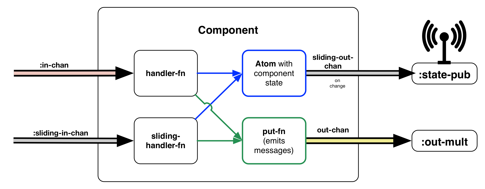
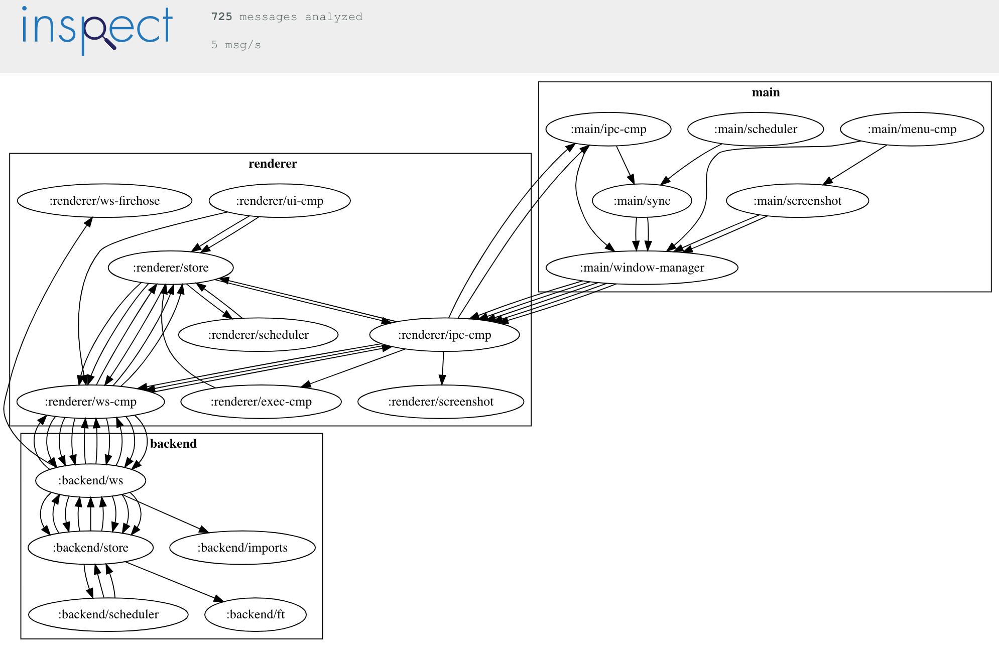
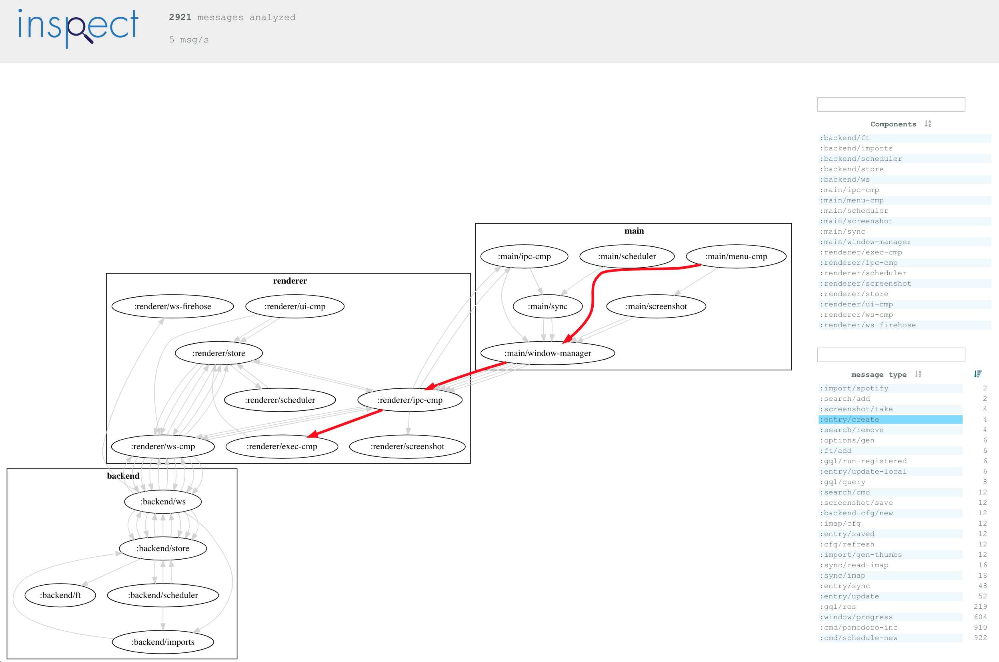
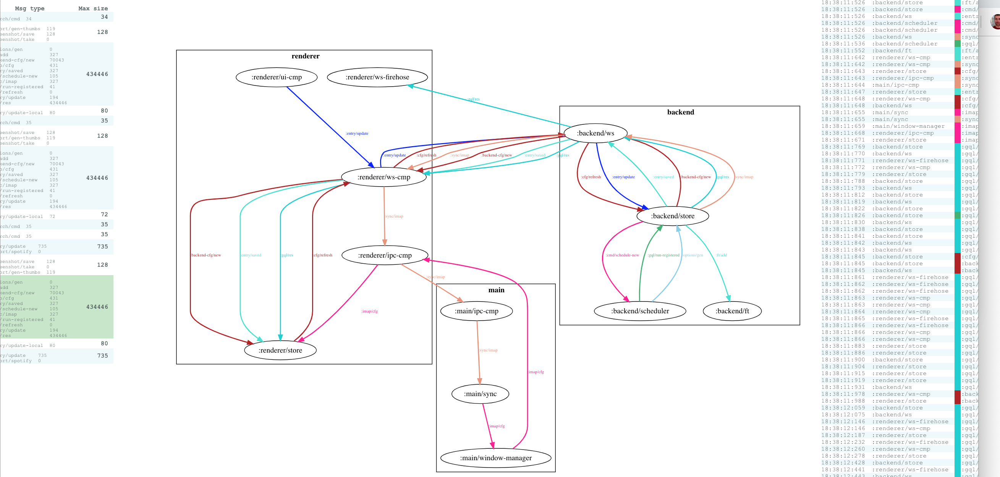

This is the first part of a series on how I built an intelligent journaling application that I use every single day - as a desktop application that is written in [Clojure](https://clojure.org) and [ClojureScript](https://clojurescript.org/). The description of the mobile app will follow. We got a lot to cover, so let's dive right in. I needed a tool that would help me get my life in order, and assist me getting the right things done, instead of just putting in a lot of hours barking up the wrong tree. That tool should also help me record the important things in my life, instead of solely relying on memory, which will be a bad bet in the long run. The tool needs to assist me in recording my life, while helping me decide what to focus on next. The tool should be helpful for other people, too, and very importantly not syphon their data off to a location outside their control, as it just does not get more private than keeping a comprehensive journal.

You can read more about the motivation in this [article](https://matthiasnehlsen.com/blog/2018/03/15/introducing-meo/). Data integrity was also an important consideration, especially since I did not want to rely on any cloud storage. That application did not exist, so I built it in [Clojure](https://clojure.org), which is my favorite programming language by far. It is currently called [meins](https://github.com/matthiasn/meins) and I will describe its architecture in this series. In the process, I will show you a way to build a **desktop application** in [Clojure](https://clojure.org) and [ClojureScript](https://clojurescript.org/), with an [Electron](https://electronjs.org/) application, written in [ClojureScript](https://clojurescript.org/), and a **JVM** process doing typical backend work such as persistence and maintaining a searchable index, where the Electron application runs the JVM process in the background. You should be able to build any other desktop application in Clojure and ClojureScript using the same building blocks, with or without a JVM backend. 

On the lowest level there is the [systems-toolbox](https://github.com/matthiasn/systems-toolbox) library. It lets you build larger systems out of communicating components, which are heavily inspired by the [actor model](https://en.wikipedia.org/wiki/Actor_model), with one difference that actors here need not know where they send messages, but instead just place a message on a channel, completely oblivious of what happens going forward.[^1] 

Components also hold some managed state inside an atom. State changes will be broadcast as snapshots so that other components can observe the state. This is useful for example when rendering a user interface based on these snapshots.

Such actors or components then get wired together by the so-called **switchboard**, which is a component that instantiates components and connects them, all based on messages it receives. This could be more dynamic, but so far I am only using this mechanism when firing up a system. Then, a larger system will emerge when multiple such systems communicate, for example via [Websockets](https://github.com/matthiasn/systems-toolbox-sente) and [Node IPC](https://github.com/matthiasn/systems-toolbox-electron) here, or also [Kafka](https://github.com/matthiasn/systems-toolbox-kafka) or [Redis](https://github.com/matthiasn/systems-toolbox-redis) (as a queue). 

As those emerging systems became larger, I find it more and more difficult to build an appropriate mental model from code alone. I thought that systems should assist me in my mental reasoning about them, beyond some logging, and some outdated, half-hearted design documents rotting in confluence. No, I'd rather look inside a running system and see what really happens, and build my mental model from what **is**, as opposed to my flawed beliefs about what the code **might do**.

You can find some of my ideas around observable systems in [inspect](https://github.com/matthiasn/inspect), which visualizes a running system built with the [systems-toolbox](https://github.com/matthiasn/systems-toolbox), and infers its structure through observing message flows. When activated, a system puts all messages it observes on the so called **firehose**, which can then be written to a file, or also put on a Kafka topic, or whatever else you want to write an adaptor for. In this case here, I use a simple append log, which **inspect** can then [tail](https://en.wikipedia.org/wiki/Tail_(Unix)) and examine independently.

This is [meins](https://github.com/matthiasn/meins), as seen by **inspect**, and only inferred from message flows and not at all from code or configuration:

I'll show you how to use it later. For now, this automatically generated drawing provides a good starting point to dive into the architecture. There are **three subsystems** here. 

On the bottom left, there is the **backend** subsystem. Most of the relevant logic in the backend resides in the `:backend/store` component, which persist each journal entry into an append log for each day. Just like any other component, the `:backend/store` component only processes a single message at a time and there is only a single store component, which guarantees that there is no chance of multiple threads writing to the file at the same time. On application startup, the logs are simply replayed, as a **complete rebuild** in the [Event Sourcing](https://martinfowler.com/eaaDev/EventSourcing.html) sense. Then, the `:backend/store` holds an **in-memory index**, modeled as a **graph** using [ubergraph](https://github.com/Engelberg/ubergraph), which can be queried at runtime using [GraphQL](https://graphql.org/), where [Lacinia](https://github.com/walmartlabs/lacinia) provides the execution engine. This subsystem communicates with the renderer process using Websockets, provided by the [systems-toolbox-sente](https://github.com/matthiasn/systems-toolbox-sente) library. The usage of Websockets or any other means of transport between components is transparent to the individual component. Components just put their messages on a conveyor belt and are done with their job.

In the middle, there is the **renderer** subsystem. This is a client-side [ClojureScript](https://clojurescript.org/) application running inside an [Electron renderer](https://electronjs.org/docs/tutorial/application-architecture) process, which is based on [Chromium](https://www.chromium.org/) and behaves like a browser window, with some additional features. Here, the UI is rendered using [reagent](https://github.com/reagent-project/reagent) and [re-frame](https://github.com/Day8/re-frame). Communication between components is once again provided by the [systems-toolbox](https://github.com/matthiasn/systems-toolbox) library, and (non-UI) components look the exact same on the **JVM** and in **ClojureScript**. The user interface sends queries to the backend, both in [GraphQL](https://graphql.org/) and as adhoc queries. These request messages are relayed to the backend using Websockets, once again using a component from the [systems-toolbox-sente](https://github.com/matthiasn/systems-toolbox-sente) library.

On the right, there is the **main** subsystem, which is yet another [ClojureScript](https://clojurescript.org/) application, this time running inside the [Electron main](https://electronjs.org/docs/tutorial/application-architecture) process, which fires up both the **backend** and the **renderer** subsystems, and provides some platform interop such as providing the application menu or listening to key combinations. There's also a component for capturing screenshots. Communication between components in the renderer and the main process is provided by the [systems-toolbox-electron](https://github.com/matthiasn/systems-toolbox-electron), which provides communication between processes that is similar to [systems-toolbox-sente](https://github.com/matthiasn/systems-toolbox-sente), except for the transport which is **Node IPC** instead of Websockets. Once again, components do not need to know any of this. There is some wiring between them and the communication component, and if the communication component is set up to relay a particular message type, it will do so.

After this brief introduction, you already know enough to start exploring the system yourself. All you need to do is download [meins](https://github.com/matthiasn/meins/releases), and then click **_Dev > Start Firehose_**. Then, download [inspect](https://github.com/matthiasn/inspect/releases/) and point it at `/tmp/meins-firehose.fh` using **_File > Open File_**. Go over to **meins** and click **_File > New Entry_**. Inspect should have automatically cartographed the application, as it has seen it thus far. Then, you can examine the data further, e.g. highlight a particular message type:

Or, further on the right, you can select specific message flow, and see what other message types were involved, and how. Here's the message flow for all messages triggered by saving a journal entry:

Next, there is a chronological list of all individual messages involved. To the right, you can look inside individual messages:

Overall, I find that such an interactive visualization quite helpful, not only when debugging message flows but also when trying to understand a system better in general. It's nice to have the system pitch in and document itself, as opposed to only having to rely on outdated documentation.

Please have a look at the [manual](https://meins.readthedocs.io/en/latest/) for finding out what else meins can do. And if you're curious to find out what's going on under the hood, you can see in 

Now you can try out more complex behavior of the

In the next post, I will show you how all of this looks in code. If you're really curious, you can also have a look at the [work in progress](https://github.com/matthiasn/gatsby-blog/blob/master/src/blog/2019-03-06-meins-intro-2.md), or you can subscribe below and I'll let you know when it's out.

Thanks & until next time,
Matthias

[^1]: This is inspired by **Rich Hickey's** talk about [core.async](https://github.com/matthiasn/talk-transcripts/blob/master/Hickey_Rich/CoreAsync-mostly-text.md), and specifically the idea of **conveyance**.
