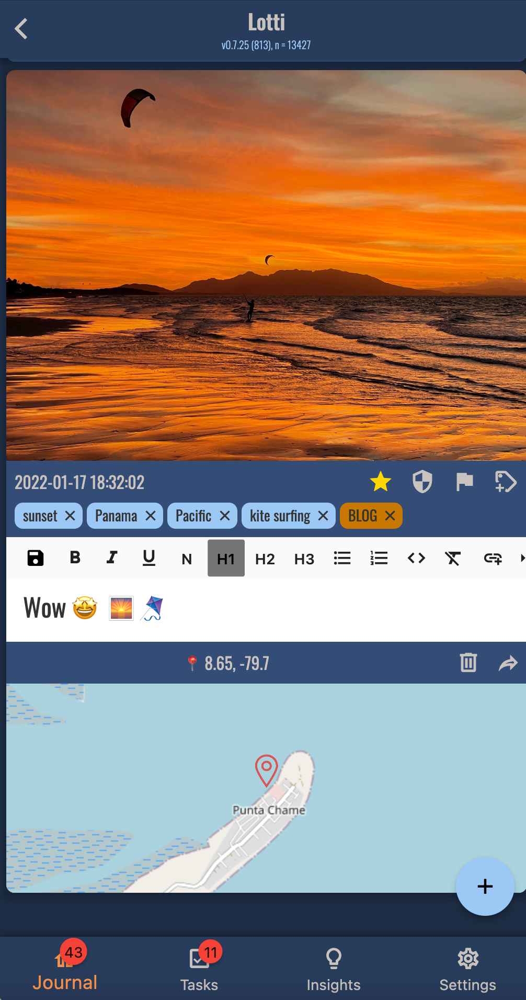
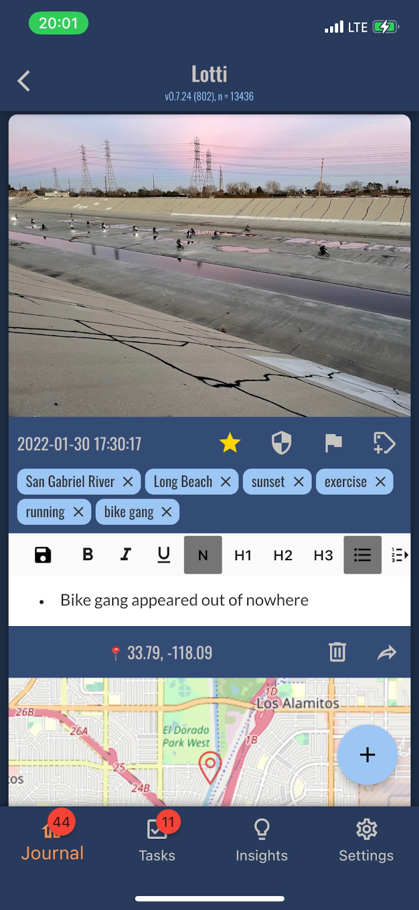
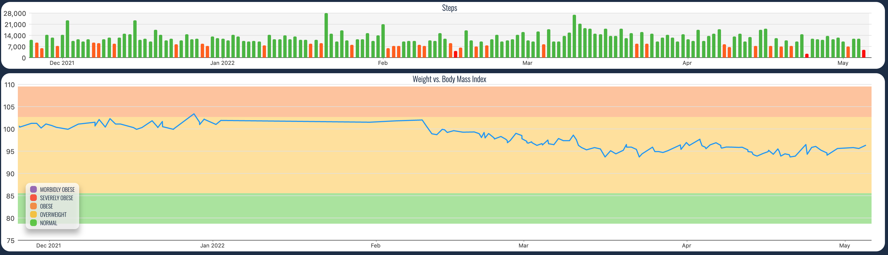
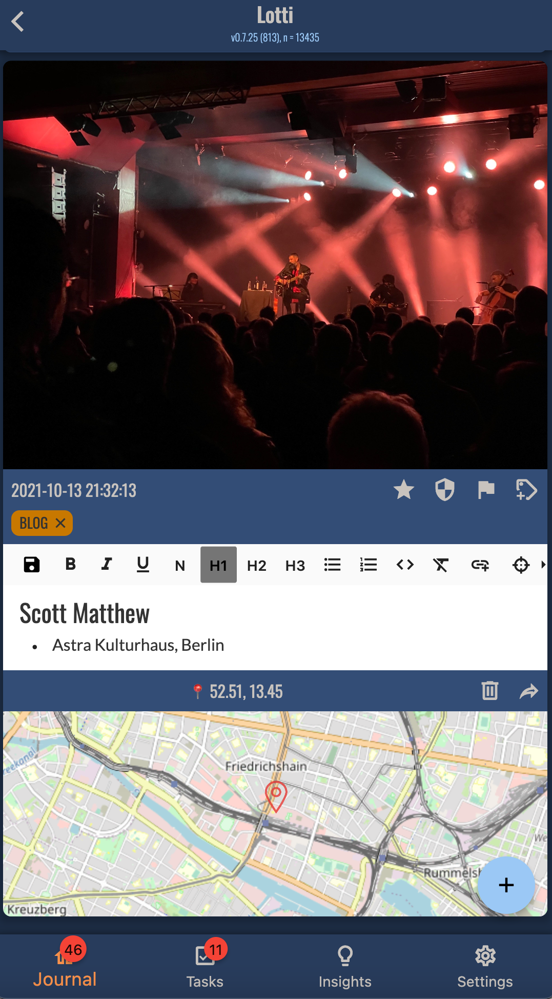
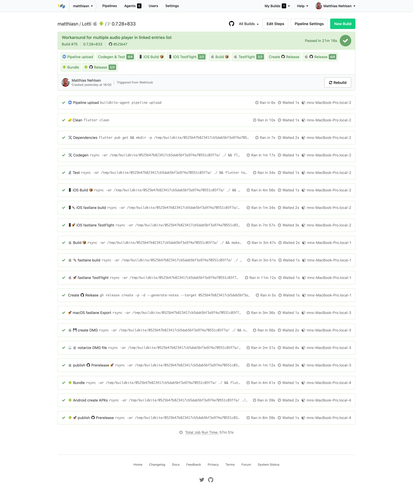

Since my last blog post, besides daytime work, I've been working on a rewrite of my data-driven journaling app (previously called Meins, now baptized [Lotti](https://github.com/matthiasn/lotti)) in [Flutter](https://flutter.dev/). 

Lotti started out as a journaling app that was inspired by my late grandmother who kept a paper-based journal about all her travels, and she traveled a lot in her lifetime. I certainly inherited that travel bug from her. Back when she introduced me to her journal in 2016, I had traveled to over 40 countries and realized that I had nowhere near as much information about each trip as she was able to produce within minutes, at age 92 and about trips when I wasn’t even born yet. Consequently, I decided to change this state of affairs. 
Since then, I’ve added 10+ countries to that list, and all of the trips are tracked in the app. However, I realized that keeping a journal now only to be able to read and enjoy decades from now is too extreme a form of delayed gratification for me, and I started exploring how I could make this app more useful in the present too. This effort is twofold: first of all, I track all my tasks in the app - this way, the journal dealing with what I’m building writes itself. Secondly, I use the app for monitoring interventions for improving my life, at this point mostly relating to health and fitness. 

Here are some screenshots that will give you an idea what I’m after:

**Fig 1: Travel log entry, on macOS (no lyrical masterpiece)**

**Fig 2: Travel log entry, on iOS **

**Fig 3: Weight vs steps per day, on macOS - unsurprisingly, more steps result in less weight (plus some other changes, but that’s for another time)**

**Fig 4: Concert in Berlin**

I will reveal much more about the app in subsequent articles. For today’s purposes, I’ll be focusing more on the technical aspects of automating the CI/CD pipeline. 

You may remember that I wrote the earlier version in Clojure and ClojureScript. I will explain in future blog posts why I decided to sunset this stack for this project and rewrite everything in [Dart](https://dart.dev/), but that will be for another day.

I've been on the verge of publishing blog posts about the rewrite for some time. However, I did not want to do so without having a beta version of the app ready for download, and that's precisely how we arrive at today's topic. Creating builds and binary files for download by hand on every change would be a total nightmare. Now, the only feasible way to release an app is via automation, which has to be ready before sharing the app. So I started working on automation.

My wishlist for automation was as follows:

* Whenever I commit code, I want the entire pipeline to run ASAP so that I can catch bugs and problems early on while the changes are still fresh in my memory. I don't have enough test coverage, especially in the integration tests (and they aren't free-of-charge in any case but add a lot of overhead, both in writing and running tests). In this situation, the best way forward is [dogfooding](https://deviq.com/practices/dogfooding/) by forcing myself to use beta software. Dogfooding is superior to extensive UI test coverage in many ways. I use Lotti all the time (in fact, I even wrote the first draft of this blog post in Lotti itself). It's active all day, typically recording time and thoughts and screenshots during tasks, and the most significant flaws have and should ordinarily continue to become apparent very quickly. If only I could get new releases onto my devices with little interruption and delay, then I would have a good shot at fixing issues before deep-diving into the next task. 

* After every commit, I want to take a short break to step away from the computer, maybe for 10 - 15 minutes to do some exercises or engage in another activity in order to return with a fresh mindset. When I later return to the screen, I want to be able to ascertain if the pipeline has failed in the meantime in order that I can remedy the issues right away. After all, at this point, I will have the best shot at fixing the problem quickly and without a complete context switch which inevitably takes time to load all the required context into my insufficiently expansive gray matter.

* I want the CI pipeline or pipelines to be fine-grained and broken up into small logical units. Occasionally, things do go wrong, and that's unavoidable. However, we can reduce the friction and frustration by enhancing visibility into the causes. Instead of having to wade through a giant blob of log lines, at the very least, I want the pipeline to be broken up into small logical units, each with their own logging output that help explain in which precise area a problem occurred.

* I want the pipeline to be able to run locally, especially when testing and refining the CI/CD pipeline itself.

* Last but not least, I want the CI/CD pipeline to be cost-efficient, as in it should not cost hundreds of dollars a month or more.

As such, I evaluated multiple different approaches that can be summarized as follows:

1. Build, archive and upload to AppStore Connect/TestFlight via Xcode. Not viable, though, as all that can take 20 minutes for each platform (provided all goes well -  it can actually take a lot longer) and requires me to stand by and occasionally click buttons repetitively. Why exactly they decided at Apple not to collect all information upfront and then let the IDE do its thing is beyond me. However, even if I didn't have to return to the keyboard multiple times, it would still be bad practice to do so in a way that requires any brain power at all, even if all upfront. Releasing software should ideally be a non-event which means that you can do so multiple times a day. Ideally, all the way through to production, but at least to some user acceptance testing stage (often called UAT).

2. Create a bash script for the steps above. After all, Xcode allows you to do all the required steps from the command line. Then run this script locally, e.g. for uploads to TestFlight. This approach works well on the happy path when everything succeeds but gives little visibility where CPU time is spent/wasted. Also, running things in parallel becomes difficult to impossible. Building iOS and macOS and uploading them to TestFlight alone, all sequentially, easily takes 30-40 minutes - too long for my taste. In addition, when things do fail, as they invariably will, it's one massive chunk of logs to go through, and it becomes challenging to restart individual fragments. On the upside, however, I'm not spending any extra money and can instead make good use of my existing hardware.

3. Transfer the steps above into a [Makefile](https://github.com/matthiasn/lotti/blob/main/Makefile), which affords more 
   fine-grained control over individual actions and makes it easier to restart failed steps instead of starting the whole thing again. However, running a Makefile is typically still inherently sequential. Running tasks in parallel, while possible, isn't a desirable option since it's not very manageable and lacks good inspectability.

4. Next, I tried running tests and deployments in hosted CI in [Codemagic](https://codemagic.io/start/), [Bitrise](https://www.bitrise.io/), and [GitHub Actions](https://github.com/features/actions). However, the available options turned out to be either slow or expensive and never impressively fast. The regular runners in their free tiers turned out to be much slower than a decently specced 2015 15" MacBook Pro, which exacerbated the problem with the limited number of minutes in the free tier. These relatively small allowances would not allow running the pipelines on every commit, even for a halfway active repository driven by a single developer. “Fine, let's throw money at the problem, shall we?” Perhaps not. The fastest runner I could find was a Mac Mini M1 runner on Codemagic. “That should suffice, no?” This still turned out to be substantially slower than when running the tasks locally on a higher-end 2019 16" eight-core MacBook Pro whilst at the same time burning cash exorbitantly. All the different publication steps combined (iOS, Android, macOS, Linux and Windows), if run sequentially, take well over an hour. At 20 cents per minute, the resulting cost would be north of $10 for a single pipeline run. There are easily more than ten a day. Even after splitting the work to ensure that the pipeline doesn't use the most expensive runner for all of the steps, the resulting expense  will still easily cost more than a Mac Mini M1 **per month**…

5. Finally, and that's the solution I settled for, I took a closer look at Buildkite and their hybrid model, and it worked out very much to my satisfaction. I'll explain how and why below.

## A hybrid CI approach with Buildkite

Buildkite has a unique approach that decouples the orchestration of the CI/CD pipeline from its execution. Their service gives me all the insights I expect from a top-notch cloud CI/CD provider, with an unusually snappy user experience. Also, Buildkite offers all the workflow benefits that one would expect, such as webhooks triggered from the SCM (source control management system, e.g. GitHub) on code pushes, PR creation etc., and then acts as a voter that blocks PRs when something fails and so on. After working with all kinds of CI/CD pipelines in the past decade or two, I have not discovered any missing parts thus far. However, the big difference is that running the agents is up to the user. Bring your own hardware, if you will.

This approach can be very appealing for several reasons:

* The CI/CD provider does not need to know your secrets. If not necessary, why share API keys, signing certificates, etc. with anyone? Not sharing secrets is a very valid point, IMHO.

* Some argue that codebases are worth protecting. If you are of that opinion, then you will like Buildkite, as they never see your code, only the logs for display in the pipeline UI. However, I don't believe that source code is all that valuable, but it is a good argument for introducing Buildkite as a CI/CD system over its alternatives. It checks those boxes for non-technical people in senior management who more often than not tend to believe that source code needs protecting like Fort Knox (spoiler alert: trying to do this is actually futile and not doable anyway, but that's a separate discussion).

* Cost. When we all started with the whole cloud trend, it all seemed so reasonable. And it was, under the assumption that prices would be fair, as opposed to the earnings from AWS which contributed significantly to sending Jeff Bezos into space. Remember those cringeworthy Skittles? Yeah, we paid for those. 
  It's all gotten costly, hasn't it? Imagine running CI/CD on a small number of your hardware, e.g. M1 Mac Minis. I've been a part of organizations where the annual CI/CD costs would have bought us 30 to 50 M1 Mac Minis, probably more. Half the number of machines would easily not only have replaced whatever infrastructure the cloud CI/CD provider used but also quite likely provided a much better developer experience. After all, you'll probably save minutes in every runner instance because whatever stack you're trying to reproduce in a single run is quite likely the same as in the previous run. Even if this is not the case, the delta will probably install in seconds (once per agent) instead of recreating the whole stack on a fresh runner from a large fleet of anonymous runners.

**Fig 5: Pipeline in Buildkite **

As with all CI/CD integrations I've ever worked on, there's plenty of trial and error to get to a working pipeline such as the one shown above, no surprises there. As such, the following were my **key learnings**:

* Build agents run in isolation. If we need to carry over results from one step to another (e.g. generated code), we need to store artifacts somewhere and download them again in the next step. Buildkite offers storing artifacts (backed by S3, I believe), but you can also provide your S3 buckets or an Artifactory instance. However, I found this to take multiple extra minutes, so I opted for a workaround using `Rsync` to sync numerous jobs against the same commit with a commit-specific directory in my /tmp/ folder. This approach is super fast on an SSD.

* On Windows, backslashes in the pipeline YAML file need to be escaped with another backslash.

* `Rsync` will warn you when files vanish from the target directory which can happen when multiple processes simultaneously access the same target directory. These vanished files have not been an issue, but Rsync will return exit code 24 in case this happens. Being a non-null exit code, this will end the execution of the pipeline step with an error.  

* Running virtual machines will slow down an eight-core i9 CPU more than I find acceptable, especially when running and building on Linux and Windows VMs in parallel.

* On the other hand, macOS runners have very little overhead, and their work gets scheduled nicely. I can comfortably continue working on the machine while  three Buildkite agents are running. Three is a reasonable level of parallelization that reduces the time required for building iOS, macOS and Android and then uploading the iOS and macOS builds to TestFlight and publishing the macOS and Android builds to GitHub releases to roughly 20-25 minutes, from about an hour when running these sequentially. In addition, since the heavy lifting occurs in the first couple of minutes, then this falls during my allocated break time anyway and will indicate build failures in 10-12 minutes for all these platforms, with the remainder taken up by uploading and waiting for the builds to show up in AppStore Connect.

## Conclusion

Now that it's working, I'm super happy with the result I achieved with Buildkite and how well it works to improve my local builds for iOS and macOS. Those can actually run on my machine in the background without too much disruption. The only thing to be mindful of is battery life which is definitely adversely impacted. But most times, the battery is charging anyway. Running Linux and Windows builds on the other hand, each in their own virtual machines in VMWare Fusion, slows down my machine too much and needs a better solution, which I will explore subsequently.

## Next steps

On the hardware side, I will probably move the Linux build onto a server with a decent [Xeon CPU](https://www.intel.com/content/www/us/en/products/details/processors/xeon/scalable.html) I have. Then for the iOS, macOS, Android and Windows builds (the latter in a VM), I will probably get a Mac Mini M1 so that I can actually close my laptop when I take a break, and have that little machine take over from there. Then I’ll measure the electricity costs. Let’s see how that fares in comparison to cloud options, both in terms of speed and cost. Not having to install any of the toolchain alone on each build will already constitute an unfair advantage over cloud runners - even if you add caches - due to the fact that saving and expanding them also takes valuable time. Then I’ll probably set up the same scenario with [self-hosted runners on GitHub Actions](https://docs.github.com/en/actions/hosting-your-own-runners/about-self-hosted-runners) for good measure even though, from a UI perspective, Buildkite is my clear favorite at this point. Stay tuned.

On the project side, I will show you how Lotti functions, what the vision of 
Lotti is and what are its applications. Spoiler alert: I’m not a fan of 
paying cloud providers tons of money for functions/storage that  my own hardware could do for much less  and, even more importantly, I also want to keep any and all kinds of personal data about my lifestyle, health and so forth  out of the cloud.

Alright, this is all for today. Please feel free to share and discuss on Twitter: I look forward to your thoughts and observations. You can also sign up for the newsletter below to ensure that you don't miss any of the upcoming articles.

Have a great week, and happy coding,

Matthias

—

### P.S.
**In case you have bandwidth, here are a few things I could do with some 
help with:**

1. [Snap version of the Linux build](https://github.com/matthiasn/lotti/issues/941). I'm running into issues as the CMake version in the build environment is too old.
2. [MSIX installer build](https://github.com/matthiasn/lotti/issues/942) issue.
3. Integration/UI test strategy.
4. [Integration tests for sync](https://github.com/matthiasn/lotti/issues/943).
5. **Translations into additional languages**. Lotti's primary language is 
   English, 
   and it is fully translated into German on an ongoing basis. Please check the [localization-related issues on GitHub](https://github.com/matthiasn/lotti/labels/Localization) if you want to help translating Lotti into additional languages, or start by simply suggesting your language of choice.

**Many thanks!**
