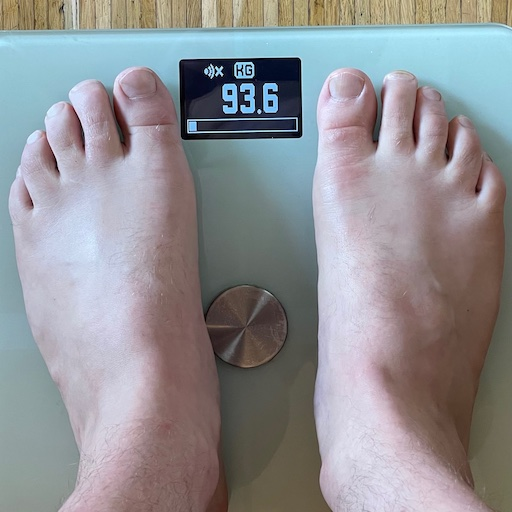
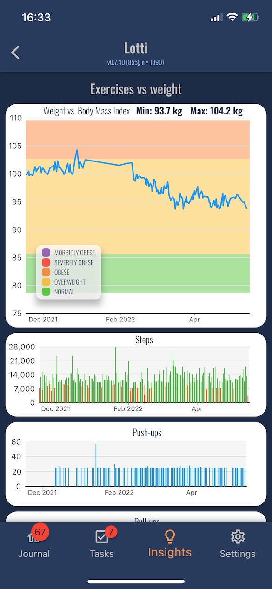

Dear Reader, dear Friend

Today's blog post is dedicated to [Flutter](https://flutter.dev/) and how it enables me to build finally what I've envisioned for years: the app, [Lotti](https://github.com/matthiasn/lotti). A few years back, I started this journaling/self-improvement/[quantified self](https://www.liebertpub. com/doi/10.1089/big.2012.0002) project in [Clojure](https://clojure.org/) and [ClojureScript](https://clojurescript.org/). While it is theoretically possible to build for both mobile and desktop with the language (which I love), it was just too complicated for me, at least, with a limited number of hours in the week. At some point along the journey, I saw Flutter, but I didn't warm up to it initially. Then, last summer, when trying to rewrite the meins desktop app and the then defunct meins mobile app in [TypeScript](https://www.typescriptlang.org/), I saw that Flutter was now aiming to build apps for **any screen**, mobile and desktop alike, and that warranted a second look.

I found myself in the luxurious position of being able to afford to take a sabbatical for a few months. I did a brief evaluation to check if what I wanted to build could be built in Flutter and concluded relatively quickly that this was indeed the case, and proceeded to jump in the deep end, learn Flutter and [Dart](https://dart.dev/), and then started to rewrite my app(s), this time mobile-first.  All of the above worked out faster than I was initially hoping for. In fact, I was dreading it, misguidedly believing that it would take much longer than it actually did. Now I have entirely switched over to the new app, with the exception of importing the old data, but that won’t run away [1].

Today, I'm happy to report on some very tangible results from this rewrite. For a long time, I had been convinced that if I could only divert my attention sufficiently towards my eating habits, how much I move and the amount of exercise I do, etc., then I would be able to monitor my activities more closely and get back into shape [2]. All I needed, in my mind back then, was to define an intervention, mostly as a loose set of rules or aims around food and activity, but without being too strict (e.g. I'm still eating Ben & Jerry's, just less often, the same goes for animal products of all kinds more broadly speaking), and then have a dashboard with a few data types, and a way to get myself to look at that dashboard. The problem was that, with my old tech stack, it was overwhelming and seemed verging on impossible to achieve. A few weeks before Christmas 2021, I was able to start collecting health and exercise-related data in the Flutter-based rewrite. From then on, I was forcing myself to look at and pay attention to my behavior and how that changed the outcome.

Long story short, by simply paying attention, moving more, and eating more healthily and less (but without tracking food, calories, etc. at all), I was able to lose about 10 kilos (around 22 pounds), more importantly, maintain my weight. Let me show you how I managed this:

**Fig 1: frequent weight measurement, ideally daily**

**Fig 2: Screenshot Lotti, weight vs steps vs Push-ups (one of six daily body weight exercises, takes less than ten minutes per day)**

Now I'm in no way saying that following the steps outlined above will give you similar results, or any results at all for that matter. What works for you is for you to find out. Once you have an idea for an experiment or intervention, Lotti can help you build a dashboard from a bunch of different data sources:

* automatically collected data from Apple Health (or the Android equivalent) [3], such as steps or hours of sleep with just a smartphone;
* exercise durations from Apple Health, either with a smartwatch or by using a running app, for example;
* weight and blood pressure from Apple Health;
* manually user-defined quantitative data, such as exercise repetitions, water or beer consumed, and anything relevant for the individual intervention.

On the contrary, its contribution is helping you monitor **any** ongoing intervention you can come up with and then help tweak and refine your approach. If you're interested in losing weight, the methods will probably not be wildly different from mine in principle. After all, we all have to find a way of balancing energy in and energy out in a healthy way that makes us feel good in our own bodies. However, how exactly and at what pace we get there is individual and should be adaptive based on what works.

On the one hand, I'm mourning the phase where I can work on a piece of software like this one all for myself and nobody else. It's a very luxurious position to be in, after all. But on the other hand, I feel that the time has come for more than one inquisitive mind (and associated  body) to benefit from these findings.

What's next:

* [Lotti](https://github.com/matthiasn/lotti) is open-source software, and I'm looking for people to form a community around the app. It doesn't matter if you're a designer, an engineer, a behavioral psychologist, someone who believes that behavior can change, and want to devise and try an experiment. In all cases, this community is for you.
* If you want to try this application and beta test it, please email me. Your onboarding experience will then be fed into in-app tutorials etc.
* As soon as possible, thereafter, the app needs to become available for everyone on the respective app stores. There are plenty more features in the pipeline, however, the capturing and monitoring of data in the dashboards — despite the fact that it has not been perfected —  is already good to go.

That's all I have for today. Have a good week!

Matthias

[1]: Since switching over earlier this year, I've collected around 14K data points in Lotti, the new app. In [meins](https://github.com/matthiasn/lotti/tree/main/meins), the former app, I still have a collection of 162K data points that I intend to migrate. But the old desktop app is still working fine, so there is no rush.

[2]: This was already a concern before Covid-19, and the pandemic only exacerbated the problems.

[3]: Lotti is cross-platform and runs on iOS, Android, macOS, Linux, and Windows. I'm using an iPhone and a MacBook personally, and I'm looking for help ensuring everything works on the other platforms. The builds generally work on all of them. Are you looking to contribute to an open-source project? This might be it. Please have a look at the [issues](https://github.com/matthiasn/lotti/issues) and help out if you can.  